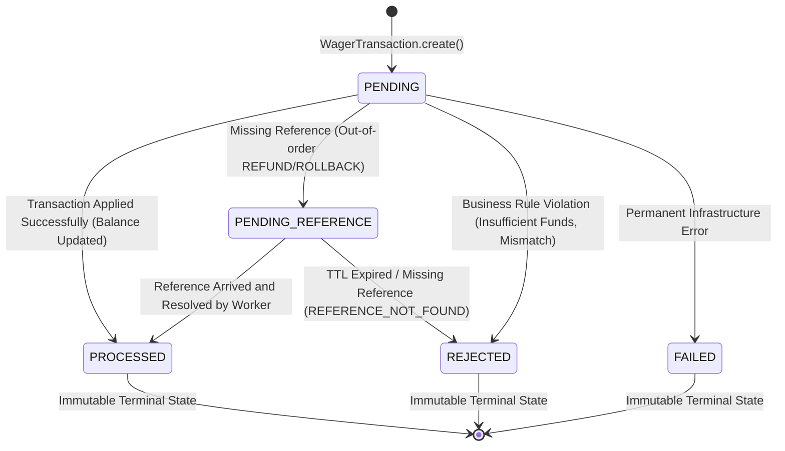
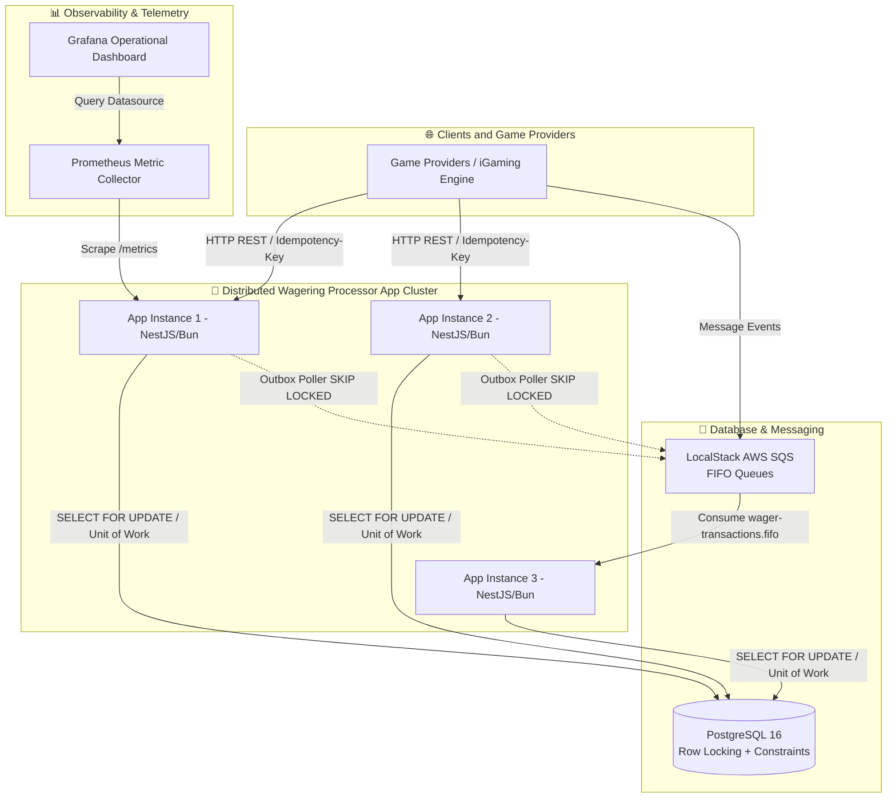

# ARCHITECTURE.md — Distributed Wagering Processor

This document details the architectural decisions, domain invariants, concurrency model, database design, and technical trade-offs of the **Distributed Wagering Processor** — a high-availability financial microservice built for iGaming platforms.

---

## 1. System Overview & Hexagonal Architecture

The system adopts **Hexagonal Architecture (Ports and Adapters)** driven by Domain-Driven Design (DDD):

```
                       ┌─────────────────────────────────────────┐
                       │               CORE DOMAIN               │
                       │  Wallet, Money, WagerTransaction,       │
                       │  WalletLedgerEntry, Domain Events       │
                       └───────────────────▲─────────────────────┘
                                           │
                       ┌───────────────────┴─────────────────────┐
                       │            APPLICATION LAYER            │
                       │  ProcessWagerUseCase, OpenWallet,       │
                       │  ReconcileWallet, Repository Ports      │
                       └───────────────────▲─────────────────────┘
                                           │
      ┌────────────────────────────────────┼────────────────────────────────────┐
      │                                    │                                    │
┌─────┴──────────────┐           ┌─────────┴────────────┐           ┌───────────┴──────────┐
│  HTTP Controllers  │           │ SQS Consumer/Poller  │           │ MikroORM Persistence │
│ (NestJS REST API)  │           │  (Inbox/Outbox Queue)│           │ (PostgreSQL Driver)  │
└────────────────────┘           └──────────────────────┘           └──────────────────────┘
```

- **Framework Decoupling**: Domain logic (`Money`, `Wallet`, `WagerTransaction`, `WalletLedgerEntry`) contains zero imports from web frameworks or ORMs.
- **Result<T, E> Monad**: Application flow utilizes an explicit Result Monad to avoid improper exception throwing along expected business execution paths.

---

## 2. Rationale Behind Technology & Implementation Choices

To build a production-ready financial wagering platform that is resilient and capable of sustaining high traffic with zero margin for inconsistencies, every technical choice was made based on practical engineering rationale:

| Technology / Pattern | Chosen Solution | Technical Rationale & Justification |
|---|---|---|
| **Runtime & Test Runner** | **Bun 1.x** | Ultra-fast native TypeScript execution without intermediate transpilation steps, accelerated package management, and high-performance integrated test runner. |
| **Web Framework** | **NestJS + Strict TypeScript** | Modular structure driven by dependency injection, facilitating the inversion of control required to isolate Hexagonal Architecture. |
| **Database & ORM** | **PostgreSQL 16 + MikroORM** | **MikroORM** was selected for its native and explicit **Unit of Work** and **Identity Map** patterns. Allows direct transaction management via `em.transactional()`, support for `LockMode.PESSIMISTIC_WRITE`, and explicit `lock_timeout` handling. |
| **Concurrency Strategy** | **Pessimistic Row Locking (`SELECT FOR UPDATE`)** | In *Hot Wallet* scenarios (multiple simultaneous bets on the same account), *Optimistic Locking* would cause a storm of version exceptions and expensive application retries. Pessimistic locking serializes updates directly inside PostgreSQL at minimal cost. |
| **Deadlock Prevention** | **`SET LOCAL lock_timeout = '2000ms'`** | To prevent concurrent transactions from waiting indefinitely for a wallet row lock, we configure a 2-second lock timeout. On breach, PostgreSQL fails fast (*fail-fast*). |
| **Idempotency Guarantee** | **Persistent SQL Table + SHA-256 Digest** | In-memory cache is strictly forbidden. Idempotency is checked in `wager_transactions` via unique constraint `(provider_id, idempotency_key)` and SHA-256 hash of canonical JSON (`payloadHash`). |
| **Event Publishing** | **Transactional Outbox (`SKIP LOCKED`)** | Prevents premature event publishing prior to SQL commit. The worker polls using `SELECT ... FOR UPDATE SKIP LOCKED`, guaranteeing support for multi-instance application deployments without duplicate message dispatches. |
| **Message Deduplication** | **Inbox Pattern (`consumer_name, message_id`)** | Ensures *at-least-once* processing. The SQS ACK (`DeleteMessage`) confirmation command is issued **strictly after COMMIT** in PostgreSQL. |
| **Monetary Precision** | **`Money` Value Object + `Decimal.js`** | Total elimination of `number`/`float` types. All monetary values are serialized as 2-decimal-place strings (`"25.00"`). |
| **Auditable Accounting** | **Double-Entry Bookkeeping** | Immutable ledger entries balancing `PLAYER_LIABILITY`, `HOUSE_PLATFORM`, and `PROVIDER_SETTLEMENT` accounts where debits and credits match (`isBalanced()`). |
| **Authentication Strategy** | **Extension Port (`ProviderAuthGuard`)** | To provide flexibility when handling requests from multiple game providers without binding the system to ad-hoc password schemes, authentication is delegated to `ProviderIdentityPort`, ready for OIDC integration with Keycloak/Zitadel. |
| **Automatic Schema Migration** | **Init Container (`wagering_migration`) + ORM Bootstrap** | The init container runs `bun run migration:up` before releasing application pods (`service_completed_successfully`). As an additional safeguard, `main.ts` triggers `orm.getMigrator().up()` on bootstrap, preventing missing table errors. |

---

## 3. Transaction State Machine Diagram (`WagerTransaction`)

The diagram below illustrates all valid state transitions of the `WagerTransaction` entity, highlighting immutable terminal states (`PROCESSED`, `REJECTED`, `FAILED`):



---

## 4. System C4 Container Diagram

High-level view showing distributed integration across multiple components:



---

## 5. Architectural Trade-off Analysis

### ⚖️ 1. Pessimistic Locking vs. Optimistic Locking
- **Decision**: Utilization of Pessimistic Row Locking (`SELECT FOR UPDATE` with `SET LOCAL lock_timeout = '2000ms'`).
- **Rationale**: In fast-paced casino games (*hot wallets*), a single player or bot can fire dozens of bets simultaneously. Version-based *Optimistic Locking* would trigger a storm of concurrency exceptions and demand expensive application retries. Pessimistic row locking serializes execution directly within PostgreSQL with minimal cost and total predictability.

### ⚖️ 2. Transactional Outbox Polling (`SKIP LOCKED`) vs. CDC (Debezium/Kafka)
- **Decision**: Periodic Outbox Worker polling using `SELECT ... FOR UPDATE SKIP LOCKED`.
- **Rationale**: While Change Data Capture (CDC) with Debezium/Kafka is ideal for hyper-growth scale, it introduces heavy operational complexity (Kafka connectors, Zookeeper/KRaft management, schema registries). Polling with `SKIP LOCKED` delivers hundreds of requests per second while preserving deployment simplicity in Docker Compose and Kubernetes.

### 3. Advisory Locks (`pg_advisory_xact_lock`)
- **Usage Documentation**: For heavy batch reconciliation routines or running concurrent migrations across app instances, `pg_advisory_xact_lock(bigint)` is recommended as a lightweight in-memory lock without locking the wallet table.

---

## 6. Engineering & Production Quality Requirements Checklist

| System Requirement | Status | Implementation Details |
|---|---|---|
| **1. Financial Correctness** | ✅ **Production Ready** | `Money` Value Object using `Decimal.js`, `NUMERIC(18,2)` SQL column, and `CHECK (balance >= 0)`. |
| **2. Authentication** | ✅ **Production Ready** | Decoupled `ProviderAuthGuard` and `ProviderIdentityPort` interface for external IdPs. |
| **3. Messaging & Invariants** | ✅ **Production Ready** | Inbox pattern `(consumer_name, message_id)`, `PENDING_REFERENCE` Worker, and `chaos.test.ts`. |
| **4. Tech Stack** | ✅ **Production Ready** | Bun 1.x, strict TypeScript, NestJS, PostgreSQL 16, LocalStack SQS FIFO, MikroORM. |
| **5. Inviolable Constraints** | ✅ **Production Ready** | Atomic guarantees enforced in both database schema and application code. |
| **6. Domain Model** | ✅ **Production Ready** | Private constructors + static factory methods on all DDD entities. |
| **7. Business Rules** | ✅ **Production Ready** | `BET`, `WIN`, `LOSS`, `REFUND`, `ROLLBACK` operations, `FailureCode` enum, and out-of-order handling. |
| **8. Concurrency** | ✅ **Production Ready** | `Pessimistic Locking` with `lock_timeout 2s`, tested in `tests/concurrency/concurrency.test.ts`. |
| **9. HTTP API** | ✅ **Production Ready** | HTTP REST endpoints exposed with complete Postman & Insomnia collections. |
| **10. SQS Processing** | ✅ **Production Ready** | SQS Consumer integrated into use case execution with DLQ management CLI (`bun run dlq:replay`). |
| **11. Transactional Outbox** | ✅ **Production Ready** | Event subclasses (`WalletBalanceChanged`, etc.) and outbox polling worker with backoff. |
| **12. Observability** | ✅ **Production Ready** | AsyncLocalStorage for JSON context logging, Prometheus metrics, and Grafana dashboard. |
| **13. Test Suite** | ✅ **Production Ready** | Multi-level test suite in `tests/` and `scripts/`. |
| **14. Performance & Load** | ✅ **Production Ready** | Benchmarking and load testing exposed via `bun run test:load`. |
