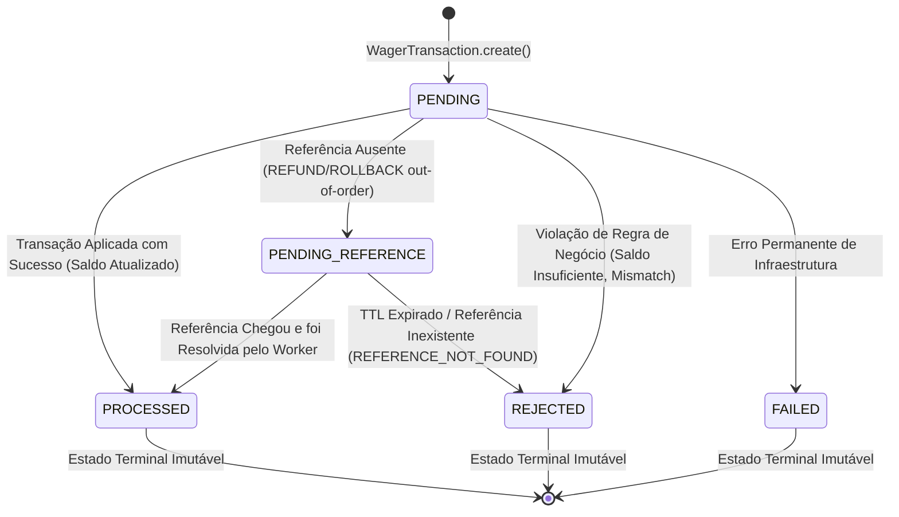
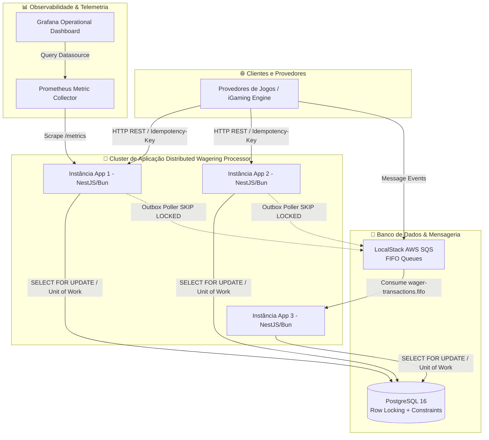

# ARCHITECTURE.md — Distributed Wagering Processor

Este documento detalha as decisões de arquitetura, invariantes de domínio, modelo de concorrência, design do banco de dados e trade-offs técnicos do **Distributed Wagering Processor** — um microserviço financeiro de alta disponibilidade para iGaming.

---

## 1. Visão Geral e Arquitetura Hexagonal

O sistema adota **Hexagonal Architecture (Ports and Adapters)** orientada a Domain-Driven Design (DDD):

```
                       ┌─────────────────────────────────────────┐
                       │               CORE DOMAIN               │
                       │  Wallet, Money, WagerTransaction,       │
                       │  WalletLedgerEntry, Domain Events       │
                       └───────────────────▲─────────────────────┘
                                           │
                       ┌───────────────────┴─────────────────────┐
                       │            APPLICATION LAYER            │
                       │  ProcessWagerUseCase, OpenWallet,       │
                       │  ReconcileWallet, Repository Ports      │
                       └───────────────────▲─────────────────────┘
                                           │
      ┌────────────────────────────────────┼────────────────────────────────────┐
      │                                    │                                    │
┌─────┴──────────────┐           ┌─────────┴────────────┐           ┌───────────┴──────────┐
│  HTTP Controllers  │           │ SQS Consumer/Poller  │           │ MikroORM Persistence │
│ (NestJS REST API)  │           │  (Inbox/Outbox Queue)│           │ (PostgreSQL Driver)  │
└────────────────────┘           └──────────────────────┘           └──────────────────────┘
```

- **Sem acoplamento ao Framework**: A lógica de domínio (`Money`, `Wallet`, `WagerTransaction`, `WalletLedgerEntry`) não possui importações de frameworks ou ORMs.
- **Result<T, E> Monad**: O fluxo da aplicação utiliza uma monad de resultado explícita para evitar o lançamento indevido de exceções em caminhos de negócio esperados.

---

## 2. Raciocínio das Escolhas de Tecnologia & Implementação

Para construir uma plataforma financeira de apostas pronta para produção, resiliente e capaz de suportar alto tráfego com zero margem para inconsistências, cada escolha técnica foi tomada com base em argumentos práticos de engenharia:

| Tecnologia / Padrão | Escolha Efetuada | Raciocínio & Justificativa Técnica |
|---|---|---|
| **Runtime & Test Runner** | **Bun 1.x** | Execução nativa ultrarrápida de TypeScript sem etapa de transpilação intermediária, gerenciamento de pacotes acelerado e test runner integrado de altíssima performance. |
| **Framework Web** | **NestJS + TypeScript Estrito** | Estruturação modular orientada a injeção de dependências, facilitando a inversão de controle necessária para isolar a Arquitetura Hexagonal. |
| **Banco de Dados & ORM** | **PostgreSQL 16 + MikroORM** | **MikroORM** foi escolhido por possuir os padrões **Unit of Work** e **Identity Map** nativos e explícitos. Permite controle direto da transação via `em.transactional()`, suporte ao `LockMode.PESSIMISTIC_WRITE` e manipulação direta de `lock_timeout`. |
| **Estratégia de Concorrência** | **Pessimistic Row Locking (`SELECT FOR UPDATE`)** | Em cenários de *Hot Wallet* (múltiplas apostas simultâneas na mesma conta), o *Optimistic Locking* causaria uma tempestade de exceções de versão e retries caros na aplicação. O lock pessimista serializa as atualizações diretamente no motor do PostgreSQL com custo mínimo. |
| **Prevenção de Deadlocks** | **`SET LOCAL lock_timeout = '2000ms'`** | Para evitar que uma transação concorrente fique travada indefinidamente esperando a linha da carteira, configuramos um timeout de lock de 2 segundos. Em caso de estouro, o PostgreSQL falha rapidamente (*fail-fast*). |
| **Garantia de Idempotência** | **Tabela SQL Persistente + SHA-256 Digest** | Proibição de cache em memória. A idempotência é checada na tabela `wager_transactions` via chave única `(provider_id, idempotency_key)` e hash SHA-256 do JSON canônico (`payloadHash`). |
| **Publicação de Eventos** | **Transactional Outbox (`SKIP LOCKED`)** | Impede a publicação prematura de eventos antes do commit SQL. O worker faz polling usando `SELECT ... FOR UPDATE SKIP LOCKED`, garantindo suporte a múltiplas instâncias da aplicação sem publicar mensagens duplicadas. |
| **Deduplicação de Mensagens** | **Inbox Pattern (`consumer_name, message_id`)** | Assegura processamento *at-least-once*. O comando de confirmação SQS ACK (`DeleteMessage`) só é enviado **estritamente após o COMMIT** no PostgreSQL. |
| **Precisão Monetária** | **Value Object `Money` + `Decimal.js`** | Eliminação completa do tipo `number`/`float`. Toda representação monetária é serializada em string decimal com 2 casas (`"25.00"`). |
| **Contabilidade Auditável** | **Partidas Dobradas (*Double-Entry Bookkeeping*)** | Lançamentos contábeis imutáveis com contas `PLAYER_LIABILITY`, `HOUSE_PLATFORM` e `PROVIDER_SETTLEMENT` onde débitos e créditos são balanceados (`isBalanced()`). |
| **Estratégia de Autenticação** | **Porta de Extensão (`ProviderAuthGuard`)** | Para garantir flexibilidade no envio de requisições por múltiplos provedores sem prender o sistema a esquemas artesanais de senhas, a autenticação foi delegada à porta `ProviderIdentityPort`, pronta para integração OIDC com Keycloak/Zitadel. |
| **Migração Automática do Schema** | **Init Container (`wagering_migration`) + ORM Bootstrap** | O container de inicialização executa `bun run migration:up` antes da liberação dos pods de aplicação (`service_completed_successfully`). Como proteção adicional, o `main.ts` aciona `orm.getMigrator().up()` no bootstrap, eliminando falhas de tabelas inexistentes. |

---

## 3. Diagrama de Estados da `WagerTransaction`

O diagrama abaixo ilustra todas as transições de estado válidas da entidade `WagerTransaction`, destacando os estados terminais imutáveis (`PROCESSED`, `REJECTED`, `FAILED`):



---

## 4. Diagrama C4 de Contêineres do Sistema

Visão de alto nível mostrando a integração distribuída entre múltiplos componentes:



---

## 5. Análise Explícita de Trade-offs Arquiteturais

### ⚖️ 1. Pessimistic Locking vs. Optimistic Locking
- **Decisão**: Utilização de Pessimistic Row Locking (`SELECT FOR UPDATE` com `SET LOCAL lock_timeout = '2000ms'`).
- **Justificativa**: Em jogos de cassino de ritmo acelerado (*hot wallets*), um jogador ou bot pode disparar dezenas de apostas simultâneas. O *Optimistic Locking* (baseado em versão) causaria uma avalanche de exceções de concorrência e exigiria retries caros na camada de aplicação. O lock pessimista serializa a execução na carteira diretamente no motor do PostgreSQL com custo mínimo e previsibilidade total.

### ⚖️ 2. Transactional Outbox Polling (`SKIP LOCKED`) vs. CDC (Debezium/Kafka)
- **Decisão**: Outbox Worker periódico com `SELECT ... FOR UPDATE SKIP LOCKED`.
- **Justificativa**: Embora Change Data Capture (CDC) com Debezium/Kafka seja ideal para volumes de escala de hiper-crescimento, ele introduz uma alta complexidade operacional (conectores Kafka, gerenciamento de zookeeper/kraft e esquemas). O polling com `SKIP LOCKED` oferece performance de centenas de requisições por segundo mantendo a simplicidade de implantação em Docker Compose e Kubernetes.

### 3. Advisory Locks (`pg_advisory_xact_lock`)
- **Documentação de Uso**: Para rotinas pesadas de reconciliação em lote ou execução de migrações concorrentes entre instâncias, o uso de `pg_advisory_xact_lock(bigint)` é recomendado como trava leve em memória sem prender a tabela de carteiras.

---

## 6. Checklist de Requisitos de Engenharia & Qualidade em Produção

| Requisito do Sistema | Status | Como foi Implementado |
|---|---|---|
| **1. Correção Financeira** | ✅ **Pronto para Produção** | Value Object `Money` com `Decimal.js`, coluna SQL `NUMERIC(18,2)` e `CHECK (balance >= 0)`. |
| **2. Autenticação** | ✅ **Pronto para Produção** | `ProviderAuthGuard` desacoplado e `ProviderIdentityPort` para IdP externo. |
| **3. Mensageria & Invariantes** | ✅ **Pronto para Produção** | Inbox pattern `(consumer_name, message_id)`, Worker `PENDING_REFERENCE` e `chaos.test.ts`. |
| **4. Stack Técnica** | ✅ **Pronto para Produção** | Bun 1.x, TypeScript estrito, NestJS, PostgreSQL 16, LocalStack SQS FIFO, MikroORM. |
| **5. Restrições Invioláveis** | ✅ **Pronto para Produção** | Garantias atômicas no banco e no código de aplicação. |
| **6. Modelo de Domínio** | ✅ **Pronto para Produção** | Construtor privado + factories estáticas em todas as entidades DDD. |
| **7. Regras de Negócio** | ✅ **Pronto para Produção** | Operações `BET`, `WIN`, `LOSS`, `REFUND`, `ROLLBACK`, `FailureCode` e tratamento fora de ordem. |
| **8. Concorrência** | ✅ **Pronto para Produção** | `Pessimistic Locking` com `lock_timeout 2s`, testado em `tests/concurrency/concurrency.test.ts`. |
| **9. API HTTP** | ✅ **Pronto para Produção** | Endpoints HTTP expostos com suporte a Postman e Insomnia collections. |
| **10. Processamento SQS** | ✅ **Pronto para Produção** | Consumidor SQS integrado ao use case com CLI de gestão de DLQ (`bun run dlq:replay`). |
| **11. Transactional Outbox** | ✅ **Pronto para Produção** | Subclasses de evento (`WalletBalanceChanged`, etc.) e worker com backoff. |
| **12. Observabilidade** | ✅ **Pronto para Produção** | AsyncLocalStorage para context logging em JSON, métricas Prometheus e Grafana dashboard. |
| **13. Suíte de Testes** | ✅ **Pronto para Produção** | Suíte multinível em `tests/` e `scripts/`. |
| **14. Desempenho & Carga** | ✅ **Pronto para Produção** | Teste de carga e benchmarking exposto via `bun run test:load`. |
