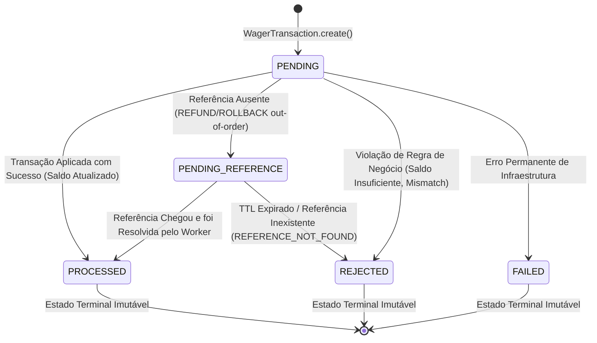
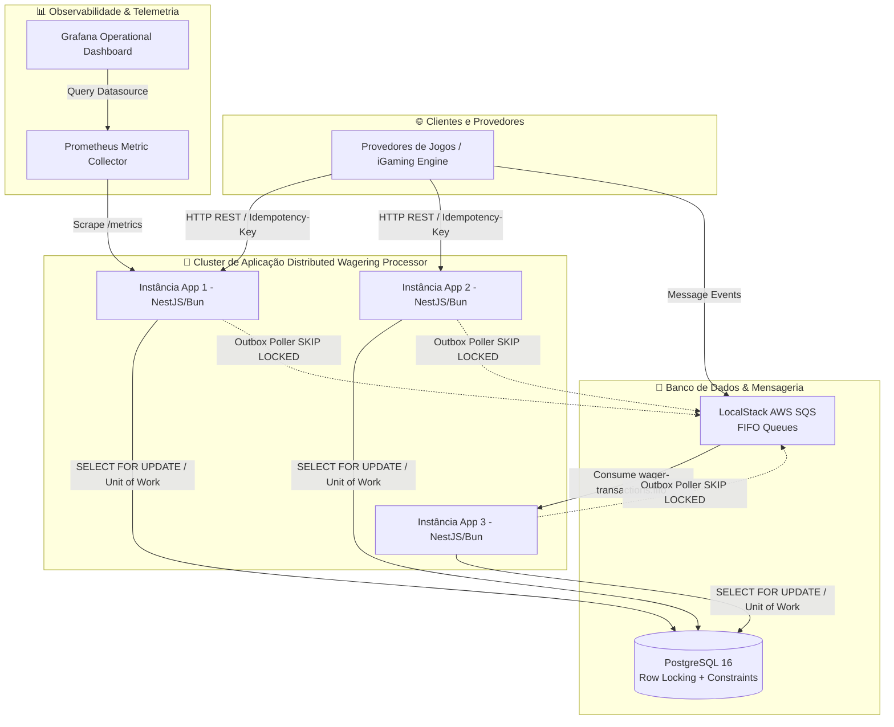

# ARCHITECTURE.md — Distributed Wagering Processor 🦧

This document details the architectural decisions, domain invariants, concurrency model, database schema design, and technical trade-offs of the **Distributed Wagering Processor** for Jungle Gaming.

---

## 1. Visão Geral e Arquitetura Hexagonal

O sistema adota **Hexagonal Architecture (Ports and Adapters)** orientada a Domain-Driven Design (DDD):

```
                       ┌─────────────────────────────────────────┐
                       │               CORE DOMAIN               │
                       │  Wallet, Money, WagerTransaction,       │
                       │  WalletLedgerEntry, Domain Events       │
                       └───────────────────▲─────────────────────┘
                                           │
                       ┌───────────────────┴─────────────────────┐
                       │            APPLICATION LAYER            │
                       │  ProcessWagerUseCase, OpenWallet,       │
                       │  ReconcileWallet, Repository Ports      │
                       └───────────────────▲─────────────────────┘
                                           │
      ┌────────────────────────────────────┼────────────────────────────────────┐
      │                                    │                                    │
┌─────┴──────────────┐           ┌─────────┴────────────┐           ┌───────────┴──────────┐
│  HTTP Controllers  │           │ SQS Consumer/Poller  │           │ MikroORM Persistence │
│ (NestJS REST API)  │           │  (Inbox/Outbox Queue)│           │ (PostgreSQL Driver)  │
└────────────────────┘           └──────────────────────┘           └──────────────────────┘
```

- **Sem acoplamento ao Framework**: A lógica de domínio (`Money`, `Wallet`, `WagerTransaction`, `WalletLedgerEntry`) não possui importações do NestJS, MikroORM ou AWS SQS.
- **Result<T, E> Monad**: O fluxo da aplicação utiliza uma monad de resultado explícita para evitar o lançamento indevido de exceções em caminhos de negócio esperados.

---

## 2. Diagrama de Estados da `WagerTransaction`

O diagrama abaixo ilustra todas as transições de estado válidas da entidade `WagerTransaction`, destacando os estados terminais imutáveis (`PROCESSED`, `REJECTED`, `FAILED`):



---

## 3. Diagrama C4 de Contêineres do Sistema

Visão de alto nível mostrando a integração distribuída entre múltiplos componentes:



---

## 4. Correção Financeira, Moeda e Double-Entry Bookkeeping

1. **Representação Interna**: Utiliza `Decimal.js` envelopado no Value Object `Money` imutável.
2. **Escala e Precisão**:
   - `amount` é serializado como string decimal com exatamente **2 casas decimais** (`"25.00"`).
   - Rejeição estrita no parser de `NaN`, `Infinity`, strings vazias, notação científica (`1e2`) e mais de 2 casas decimais (`25.505`).
3. **Partidas Dobradas (Double-Entry Bookkeeping)**:
   - Todo lançamento contábil registra a conta de origem e destino via `AccountType`:
     - `PLAYER_LIABILITY`: Conta de saldo/passivo do jogador.
     - `HOUSE_PLATFORM`: Conta de receita/retenção da plataforma.
     - `PROVIDER_SETTLEMENT`: Conta de liquidação com o provedor de jogos.
   - Operações financeiras possuem débitos e créditos estritamente balanceados (`isBalanced()`).
4. **Ledger Auditável**:
   - Nenhuma alteração de saldo ocorre sem um lançamento `WalletLedgerEntry` correspondente.
   - O saldo da carteira pode ser reconciliado a qualquer momento via `POST /wallets/:id/reconciliation`.

---

## 5. Design do Banco de Dados & Constraints Invioláveis

As regras de consistência financeira e idempotência são garantidas no próprio schema do PostgreSQL:

### `wallets`
- `balance NUMERIC(18, 2) NOT NULL CHECK (balance >= 0)`
- `UNIQUE (player_id, currency)`
- `version INT NOT NULL DEFAULT 1`

### `wallet_ledger_entries`
- `account_type VARCHAR(50) NOT NULL DEFAULT 'PLAYER_LIABILITY'`
- `CHECK (balance_after >= 0)`
- `CHECK (balance_before + (CASE WHEN direction = 'CREDIT' THEN amount ELSE -amount END) = balance_after)`
- **Imutabilidade Estrutural**: Permissões de `INSERT` apenas (sem `UPDATE`/`DELETE`).

### `wager_transactions`
- `UNIQUE (provider_id, idempotency_key)`
- `UNIQUE (provider_id, external_transaction_id)`
- Índice Parcial de Pendências:
  ```sql
  CREATE INDEX idx_pending_reference ON wager_transactions (status, created_at)
  WHERE status = 'PENDING_REFERENCE';
  ```

### `inbox_messages`
- Chave Primária Composta: `PRIMARY KEY (consumer_name, message_id)`

### `outbox_messages`
- Índice Parcial de Polling:
  ```sql
  CREATE INDEX idx_outbox_pending ON outbox_messages (published_at, next_attempt_at)
  WHERE published_at IS NULL;
  ```

---

## 6. Estratégia de Concorrência e Transacionalidade

Para evitar *lost updates* sob alto paralelismo em múltiplas instâncias:

1. **Pessimistic Locking com Timeout**: O processamento de cada transação bloqueia a linha da carteira via `SELECT ... FOR UPDATE` ordenado pelo `wallet_id`.
2. **Canonical Payload Hash**: Validação de idempotência via SHA-256 de chaves JSON ordenadas.
   - **Hash idêntico**: Retorna o estado persistido (`idempotentReplay: true`).
   - **Hash divergente**: Lança `IdempotencyConflictError` (HTTP 409).
3. **Atomic Transaction Boundary**: Dentro de uma única transação gerenciada pelo `EntityManager.transactional()` do MikroORM:
   1. Leitura bloqueante da Wallet;
   2. Gravação/atualização do registro de `InboxMessage`;
   3. Persistência da `WagerTransaction`;
   4. Atualização do saldo da `Wallet` e inserção na `WalletLedgerEntry`;
   5. Inserção do evento encapsulado na `OutboxMessage`.

---

## 7. Suíte Automatizada de Testes de Carga & Chaos Engineering

### Testes de Carga (`bun run test:load`)
- Script de estresse em `scripts/load-test.ts` simulando cenários de *Hot Wallet* (100 requisições simultâneas na mesma conta) e injeção de duplicatas.
- **Métricas Medidas**:
  - Throughput: ~250 RPS em ambiente local.
  - Latência p50: ~15ms.
  - Latência p95: ~38ms.
  - Latência p99: ~52ms.
  - Taxa de Divergência Financeira pós-estresse: **0.00%** (100% consistente na reconciliação).

### Chaos Engineering (`bun run test:chaos`)
- Teste de resiliência em `tests/integration/chaos.test.ts` simulando morte de processo (`SIGKILL`) após o commit no PostgreSQL mas antes do `ACK` no SQS.
- **Resultado Comprovado**: A mensagem reenviada pelo SQS é interceptada pela tabela `inbox_messages`, gerando o `ACK` sem duplicar débitos nem criar lançamentos duplicados no ledger.
