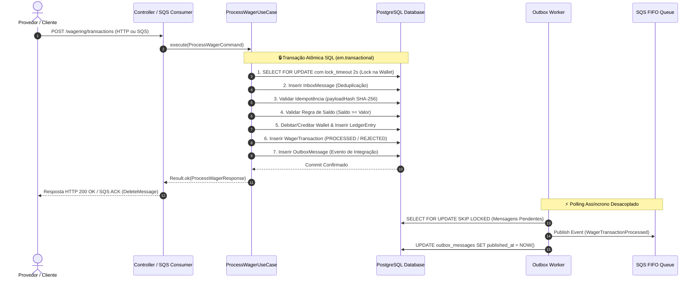

# 🦧 Distributed Wagering Processor — Jungle Gaming

[](https://bun.sh/)
[](https://www.typescriptlang.org/)
[](https://nestjs.com/)
[](https://www.postgresql.org/)
[](https://aws.amazon.com/sqs/)
[](https://www.docker.com/)
[](https://opensource.org/licenses/MIT)

> [!IMPORTANT]
> **Microserviço financeiro distribuído de alta concorrência** para processamento de transações de apostas em tempo real da plataforma **Jungle Gaming**.
> Garante consistência financeira estrita, idempotência persistente, ledger contábil imutável (Partidas Dobradas) e resiliência total contra falhas distribuídas e redelivery de mensagens.

> [!NOTE]
> ### 👤 Candidate & Application Info
> - **Candidato**: Matheus Ferreira
> - **Perfil no GitHub**: [@matheustheus27](https://github.com/matheustheus27)
> - **Desafio Técnico**: Distributed Wagering Processor
> - **Posição**: Backend Developer na **Jungle Gaming** 🦧

---

## 💡 Entendendo o Problema (Sem Complicação!)

Imagine que você está jogando em um cassino online. Você faz uma aposta de **R$ 25,00**. Nesse exato milissegundo:
1. O jogo avisa o sistema: *"Debite R$ 25,00 do jogador X"*.
2. A sua conexão de internet oscila e o jogo reenvia a mesma mensagem **3 vezes**.
3. Ao mesmo tempo, você abriu o jogo em outra aba e tentou apostar mais **R$ 80,00**, mas seu saldo inicial era de apenas **R$ 100,00**.

> [!WARNING]
> **O que um sistema financeiro de verdade NÃO pode deixar acontecer?**
> - ❌ Não pode descontar a mesma aposta 3 vezes (**Idempotência**).
> - ❌ Não pode deixar o saldo ficar negativo (**Consistência Financeira**).
> - ❌ Não pode perder a conta ou calcular centavos errado (**Precisão Decimal `Money`**).
> - ❌ Não pode travar nem dar erro se tiverem 10.000 pessoas jogando juntas (**Concorrência & Resiliência**).

Este projeto é a solução para esse problema: um microserviço financeiro distribuído, resiliente a falhas e pronto para rodar em produção em múltiplos servidores simultâneos.

---

## 🔄 Fluxo de Dados e Transacionalidade Atômica

O diagrama abaixo ilustra o ciclo de vida completo de uma transação de aposta, desde a chegada da requisição até a persistência atômica no banco e a publicação assíncrona do evento:



---

## 🌟 8 Diferenciais de Alta Engenharia Incorporados

1. **⚡ Suite Automatizada de Testes de Carga (`bun run test:load`)**: Script de benchmarking simulando cenários de *Hot Wallet* (100 requisições simultâneas na mesma conta) e injeção massiva de duplicatas.
2. **💥 Chaos Engineering & Resiliência (`bun run test:chaos`)**: Teste de integração automatizado simulando queda de processo (`SIGKILL`) pós-commit.
3. **📊 Double-Entry Bookkeeping (Partidas Dobradas)**: Lançamentos contábeis balanceados entre `PLAYER_LIABILITY`, `HOUSE_PLATFORM` e `PROVIDER_SETTLEMENT`.
4. **🔍 Context Logging & Telemetria**: `AsyncLocalStorage` nativo propagando `correlationId`, `walletId` e `traceId` automaticamente em logs JSON Pino.
5. **📥 Gestão de DLQ CLI (`bun run dlq:inspect` / `bun run dlq:replay`)**: Ferramenta de inspeção e reprocessamento de mensagens da Dead Letter Queue.
6. **🔌 Postman & Insomnia Collections Prontas**: Coleções interativas prontas em `docs/` com scripts de automação de variáveis embutidos.
7. **⚙️ CI/CD Pipeline (GitHub Actions)**: Workflows automatizados em `.github/workflows/ci.yml`.
8. **☸️ Manifestos Kubernetes Produção-Ready (`k8s/`)**: Deployment com HPA de 3-10 réplicas, ConfigMap, Service e Liveness/Readiness probes.

---

## 🚀 Como Rodar o Projeto em 1 Comando

> [!TIP]
> **Usando Taskfile ou Makefile (Recomendado)**

```bash
task up         # Ou 'make up' -> Sobe PostgreSQL, LocalStack, Prometheus e Grafana
task test       # Ou 'make test' -> Executa testes unitários
task test:smoke # Ou 'make smoke-test' -> Executa o teste rápido E2E de corrida de saldo
task test:load  # Ou 'make test-load' -> Executa teste de carga e benchmarking
```

### Usando Docker Compose Direto
```bash
docker compose up --build --scale app=3
```

---

## 📂 Organização do Código (Estrutura de Diretórios)

```
DistributedWageringProcessor/
├── 📁 .github/                         # Workflows de Integração Contínua (CI/CD)
│   └── 📁 workflows/
│       └── ⚙️ ci.yml                    # Pipeline GitHub Actions (Build, Migrações, Testes)
├── 📁 docs/                            # 📚 Documentação Técnica Detalhada por Módulos
│   ├── 📄 00-visao-geral.md            # Contexto do negócio iGaming e invariantes globais
│   ├── 📄 01-arquitetura.md            # Arquitetura Hexagonal, DDD e Diagramas C4
│   ├── 📄 02-api-e-payloads.md         # Especificação completa da API, DTOs e FailureCodes
│   ├── 📄 03-mensageria-e-sqs.md       # Payloads SQS FIFO, Inbox Pattern e DLQ CLI
│   ├── 📄 04-concorrencia-e-locks.md   # Pessimistic Locking, Hash Canônico e Double-Entry
│   ├── 📄 05-guia-de-execucao.md       # Comandos de automação, Grafana e Testes de Carga
│   ├── 📄 06-testes-e-qualidade.md     # Documentação detalhada de cada tipo de teste
│   ├── 📜 wagering-api.postman_collection.json  # Coleção Postman com Automação de Variáveis
│   └── 📜 wagering-api.insomnia_collection.json # Coleção Insomnia com Encadeamento de Respostas
├── 📁 src/                             # Código-fonte da aplicação (Hexagonal Architecture)
│   ├── 📁 core/                        # Núcleo compartilhado DDD (Domain primitives, Result, Errors)
│   │   ├── 📁 application/             # Monad funcional Result<T, E>
│   │   ├── 📁 domain/                  # ValueObject e AggregateRoot base
│   │   └── 📁 errors/                  # Hierarquia AppError, DomainError e FailureCode enum
│   ├── 📁 modules/                     # Módulos de Domínio da Aplicação
│   │   ├── 📁 messaging/               # 📬 Transacional Outbox & Inbox
│   │   │   ├── 📁 application/         # Contratos de repositório Inbox e Outbox
│   │   │   ├── 📁 domain/              # Entities InboxMessage, OutboxMessage e IntegrationEvents
│   │   │   └── 📁 infrastructure/      # Repositórios MikroORM, SQS Producer/Consumer e Poller Worker
│   │   ├── 📁 wagering/                # 🎲 Gestão de Apostas & Transações
│   │   │   ├── 📁 application/         # Use Cases (ProcessWagerUseCase, GetWagerTransactionUseCase)
│   │   │   ├── 📁 domain/              # Entity WagerTransaction, Estados e Regras por Kind
│   │   │   └── 📁 infrastructure/      # Controller HTTP, DTOs e PendingReferenceWorker
│   │   └── 📁 wallet/                  # 👛 Gestão de Carteiras & Ledger Auditável
│   │       ├── 📁 application/         # Use Cases (OpenWallet, GetWallet, GetLedger, ReconcileWallet)
│   │       ├── 📁 domain/              # Wallet Aggregate Root, Money Value Object, WalletLedgerEntry
│   │       └── 📁 infrastructure/      # Controller HTTP, DTOs, Entidades e Repositórios MikroORM
│   ├── 📁 shared/                      # Infraestrutura compartilhada da aplicação
│   │   ├── 📁 application/             # Contrato IUnitOfWork
│   │   └── 📁 infrastructure/          # Database UnitOfWork, Migrações SQL, AsyncLocalStorage, Telemetria e Health
│   └── 📄 main.ts                      # Ponto de entrada NestJS com Bootstrapping e Pipes
├── 📁 tests/                           # Suíte de Testes Automatizados
│   ├── 📁 unit/                        # Testes unitários (Money, Wallet, WagerTransaction)
│   ├── 📁 integration/                 # Testes de integração e Chaos Engineering (chaos.test.ts)
│   └── 📁 concurrency/                 # Testes de concorrência e consistência financeira
├── 📁 scripts/                         # Scripts de Automação & Load Test
│   ├── 📜 smoke-test.ts                # Teste E2E rápido de fumaça e corrida de saldo (bun run test:smoke)
│   ├── 📜 load-test.ts                 # Script de benchmarking e estresse de carga (bun run test:load)
│   ├── 📜 dlq-management.ts            # CLI de inspeção e replay de DLQ (bun run dlq:replay)
│   └── 📜 init-localstack.sh           # Auto-provisionamento de Filas FIFO SQS no LocalStack
├── 📁 k8s/                             # Manifestos Produção-Ready Kubernetes
│   ├── 📄 configmap.yaml               # Configurações do Cluster K8s
│   ├── 📄 deployment.yaml              # Deployment com 3 réplicas e Liveness/Readiness probes
│   ├── 📄 hpa.yaml                     # HorizontalPodAutoscaler (3-10 pods)
│   └── 📄 service.yaml                 # ClusterIP Service
├── 📁 .vscode/                         # Configurações padronizadas de IDE (Formatters, EOL e Extensions)
├── 📁 docker/                          # Configurações de Monitoramento
│   ├── 📁 grafana/                     # Provisionamento de Dashboards Grafana
│   └── 📜 prometheus.yml               # Configuração do Prometheus Metrics Scraper
├── 📋 Taskfile.yml                     # Automação de tarefas multiplataforma (Task)
├── 🔨 Makefile                         # Comandos de automação GNU Make (make up, test, load)
├── 🐳 docker-compose.yml              # Orquestração de Containers (Postgres, LocalStack, App, Prometheus, Grafana)
├── 🐳 Dockerfile                       # Containerização usando Bun 1.x Alpine
├── ⚙️ commitlint.config.js             # Padronização de Conventional Commits
├── ⚙️ mikro-orm.config.ts             # Configuração ORM, conexão PostgreSQL e Migrações
├── 📜 package.json                    # Dependências da aplicação e scripts de execução Bun
├── 📄 tsconfig.json                   # Configuração estrita do TypeScript e Path Aliases (@core, @modules)
├── ⚙️ .editorconfig                    # Padronização de formatação de código entre editores
├── 🙈 .gitignore                      # Regras de exclusão de artefatos e segredos para Git
├── 📖 README.md                       # Documentação didática do projeto
├── 📐 ARCHITECTURE.md                 # Documento detalhado de decisões arquiteturais, C4 e banco de dados
└── 🔒 .env.example                    # Modelo de variáveis de ambiente
```

---

## 📚 Central de Documentação Técnica Detalhada (`docs/`)

Para explorar a documentação completa por tópicos:

- 📄 **[00 — Visão Geral do Sistema](docs/00-visao-geral.md)**: Contexto de iGaming, desafios de sistemas distribuídos e ER Diagram do banco.
- 📐 **[01 — Arquitetura do Sistema & Diagramas](docs/01-arquitetura.md)**: Camadas da Arquitetura Hexagonal, Diagrama C4 de Contêineres e Máquina de Estados.
- 📡 **[02 — Especificação Completa da API & Payloads](docs/02-api-e-payloads.md)**: Todos os endpoints HTTP, exemplos de request/response e tabela de `FailureCode`.
- 📬 **[03 — Mensageria, SQS FIFO & Outbox Pattern](docs/03-mensageria-e-sqs.md)**: Payloads SQS FIFO, Inbox pattern e comandos CLI da DLQ.
- 🔒 **[04 — Concorrência, Locking & Double-Entry](docs/04-concorrencia-e-locks.md)**: Pessimistic Locking (`SELECT FOR UPDATE`), hash canônico SHA-256 e partidas dobradas.
- 🚀 **[05 — Guia de Execução & Testes](docs/05-guia-de-execucao.md)**: Automação via Taskfile/Makefile, Dashboard Grafana e relatório de testes de carga.
- 🧪 **[06 — Suíte de Testes & Garantia de Qualidade](docs/06-testes-e-qualidade.md)**: Documentação detalhada dos testes unitários, concorrência, chaos engineering, smoke test e load test.
