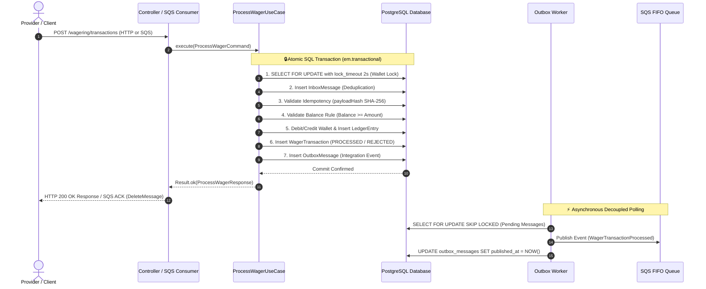

# Distributed Wagering Processor


> [!IMPORTANT]
> **High-concurrency distributed financial microservice** for real-time betting transaction processing.
> Guarantees strict financial consistency, persistent idempotency, immutable accounting ledger (Double-Entry Bookkeeping), and total resilience against distributed failures and message redelivery.

---

## 💡 Understanding the Problem (Without the Noise!)

Imagine playing at an online casino. You place a **$25.00** bet. In that exact millisecond:
1. The game notifies the system: *"Debit $25.00 from player X"*.
2. Your internet connection hiccups and the game re-sends the same message **3 times**.
3. Simultaneously, you opened the game in another tab and tried to bet another **$80.00**, but your initial balance was only **$100.00**.

> [!WARNING]
> **What can a real-world financial system NEVER allow to happen?**
> - ❌ It cannot debit the same bet 3 times (**Idempotency**).
> - ❌ It cannot allow the balance to go negative (**Financial Consistency**).
> - ❌ It cannot lose track of entries or calculate cents wrong (**`Money` Decimal Precision**).
> - ❌ It cannot lock up or fail when 10,000 people play simultaneously (**Concurrency & Resilience**).

This project is the solution to that problem: a fault-tolerant, production-ready distributed financial microservice capable of running across multiple servers concurrently.

---

## 🔄 Data Flow and Atomic Transactionality

The sequence diagram below illustrates the complete lifecycle of a wagering transaction, from request arrival to atomic persistence in the database and asynchronous event publication:



---

## 🌟 8 High-Engineering Highlights

1. **⚡ Automated Load Testing Suite (`bun run test:load`)**: Benchmarking script simulating *Hot Wallet* contention (100 simultaneous requests on the same account) and massive duplicate injection.
2. **💥 Chaos Engineering & Resilience (`bun run test:chaos`)**: Automated integration test simulating process crashes (`SIGKILL`) post-database commit.
3. **📊 Double-Entry Bookkeeping**: Balanced accounting entries across `PLAYER_LIABILITY`, `HOUSE_PLATFORM`, and `PROVIDER_SETTLEMENT`.
4. **🔍 Context Logging & Telemetry**: Native `AsyncLocalStorage` propagating `correlationId`, `walletId`, and `traceId` automatically across JSON Pino logs.
5. **📥 DLQ CLI Management (`bun run dlq:inspect` / `bun run dlq:replay`)**: Tooling for inspecting and replaying Dead Letter Queue messages.
6. **🔌 Postman & Insomnia Collections Ready**: Ready-to-use collections in `docs/` with built-in variable automation scripts.
7. **⚙️ CI/CD Pipeline (GitHub Actions)**: Automated workflows configured in `.github/workflows/ci.yml`.
8. **☸️ Production-Ready Kubernetes Manifests (`k8s/`)**: Deployment configured with HPA (3-10 replicas), ConfigMap, Service, and Liveness/Readiness probes.

---

## 🚀 How to Run in 1 Command

> [!TIP]
> **Using Taskfile or Makefile (Recommended)**

```bash
task up         # Or 'make up' -> Launches PostgreSQL, LocalStack, Prometheus, and Grafana
task test       # Or 'make test' -> Runs unit tests
task test:smoke # Or 'make test-smoke' -> Runs fast E2E smoke test & balance race verification
task test:load  # Or 'make test-load' -> Runs automated load test & benchmarking
```

### Using Direct Docker Compose
```bash
docker compose up --build --scale app=3
```

---

## 📂 Codebase Organization (Directory Structure)

```
DistributedWageringProcessor/
├── 📁 .github/                         # Continuous Integration Workflows (CI/CD)
│   └── 📁 workflows/
│       └── ⚙️ ci.yml                   # GitHub Actions Pipeline (Build, Migrations, Tests)
├── 📁 docs/                            # 📚 Detailed Technical Documentation by Module
│   ├── 📄 00-overview.md               # iGaming business context and global invariants
│   ├── 📄 01-architecture.md           # Hexagonal Architecture, DDD, and C4 Diagrams
│   ├── 📄 02-api-and-payloads.md       # Complete API spec, DTOs, and FailureCodes
│   ├── 📄 03-messaging-and-sqs.md      # SQS FIFO payloads, Inbox Pattern, and DLQ CLI
│   ├── 📄 04-concurrency-and-locks.md  # Pessimistic Locking, Canonical Hash, and Double-Entry
│   ├── 📄 05-execution-guide.md        # Automation commands, Grafana, and Load Testing
│   ├── 📄 06-testing-and-quality.md             # Detailed documentation for every test suite
│   ├── 📜 wagering-api.postman_collection.json  # Postman collection with variable automation
│   └── 📜 wagering-api.insomnia_collection.json # Insomnia collection with response chaining
├── 📁 src/                             # Application Source Code (Hexagonal Architecture)
│   ├── 📁 core/                        # Shared DDD Core (Domain primitives, Result, Errors)
│   │   ├── 📁 application/             # Result<T, E> functional monad
│   │   ├── 📁 domain/                  # Base ValueObject and AggregateRoot
│   │   └── 📁 errors/                  # AppError, DomainError hierarchy, and FailureCode enum
│   ├── 📁 modules/                     # Application Domain Modules
│   │   ├── 📁 messaging/               # 📬 Transactional Outbox & Inbox
│   │   │   ├── 📁 application/         # Inbox and Outbox repository contracts
│   │   │   ├── 📁 domain/              # InboxMessage, OutboxMessage, and IntegrationEvents
│   │   │   └── 📁 infrastructure/      # MikroORM repos, SQS Producer/Consumer, and Poller Worker
│   │   ├── 📁 wagering/                # 🎲 Wager & Transaction Management
│   │   │   ├── 📁 application/         # Use Cases (ProcessWagerUseCase, GetWagerTransactionUseCase)
│   │   │   ├── 📁 domain/              # Entity WagerTransaction, States, and Rules by Kind
│   │   │   └── 📁 infrastructure/      # HTTP Controller, DTOs, and PendingReferenceWorker
│   │   └── 📁 wallet/                  # 👛 Wallet Management & Auditable Ledger
│   │       ├── 📁 application/         # Use Cases (OpenWallet, GetWallet, GetLedger, ReconcileWallet)
│   │       ├── 📁 domain/              # Wallet Aggregate Root, Money Value Object, WalletLedgerEntry
│   │       └── 📁 infrastructure/      # HTTP Controller, DTOs, Entities, and MikroORM repos
│   ├── 📁 shared/                      # Shared Application Infrastructure
│   │   ├── 📁 application/             # IUnitOfWork contract
│   │   └── 📁 infrastructure/          # Database UnitOfWork, SQL Migrations, AsyncLocalStorage, Telemetry, and Health
│   └── 📄 main.ts                      # NestJS Entrypoint with Bootstrapping and Pipes
├── 📁 tests/                           # Automated Test Suite
│   ├── 📁 unit/                        # Unit tests (Money, Wallet, WagerTransaction)
│   ├── 📁 integration/                 # Integration and Chaos Engineering tests (chaos.test.ts)
│   └── 📁 concurrency/                 # Concurrency and financial consistency tests
├── 📁 scripts/                         # Automation & Load Test Scripts
│   ├── 📜 smoke-test.ts                # Fast E2E smoke test & balance race check (bun run test:smoke)
│   ├── 📜 load-test.ts                 # Benchmarking and load stress script (bun run test:load)
│   ├── 📜 dlq-management.ts            # DLQ inspection and replay CLI (bun run dlq:replay)
│   └── 📜 init-localstack.sh           # Auto-provisioning of SQS FIFO queues in LocalStack
├── 📁 k8s/                             # Production-Ready Kubernetes Manifests
│   ├── 📄 configmap.yaml               # K8s Cluster Configuration
│   ├── 📄 deployment.yaml              # Deployment with 3 replicas and Liveness/Readiness probes
│   ├── 📄 hpa.yaml                     # HorizontalPodAutoscaler (3-10 pods)
│   └── 📄 service.yaml                 # ClusterIP Service
├── 📁 .vscode/                         # Standardized IDE Settings (Formatters, EOL, Extensions)
├── 📁 docker/                          # Monitoring Configuration
│   ├── 📁 grafana/                     # Grafana Dashboard Provisioning
│   └── 📜 prometheus.yml               # Prometheus Metrics Scraper Configuration
├── 📋 Taskfile.yml                     # Cross-platform task automation (Task)
├── 🔨 Makefile                         # GNU Make automation commands (make up, test, load)
├── 🐳 docker-compose.yml               # Container Orchestration (Postgres, LocalStack, App, Prometheus, Grafana)
├── 🐳 Dockerfile                       # Containerization using Bun 1.x Alpine
├── ⚙️ commitlint.config.js             # Conventional Commits Enforcement
├── ⚙️ mikro-orm.config.ts              # ORM config, PostgreSQL connection, and Migrations
├── 📜 package.json                     # Application dependencies and Bun execution scripts
├── 📄 tsconfig.json                    # Strict TypeScript configuration and Path Aliases (@core, @modules)
├── ⚙️ .editorconfig                    # Code formatting standard across editors
├── 🙈 .gitignore                       # Git exclusion rules for artifacts and secrets
├── 📖 README.md                        # Main project documentation
├── 📐 ARCHITECTURE.md                  # Detailed architecture decisions, C4, and database design
└── 🔒 .env.example                     # Environment variables template
```

---

## 📚 Technical Documentation Hub (`docs/`)

Explore detailed technical documentation by topic:

- 📄 **[00 — System Overview](docs/00-overview.md)**: iGaming business context, distributed system challenges, and database ER Diagram.
- 📐 **[01 — System Architecture & Diagrams](docs/01-architecture.md)**: Hexagonal Architecture layers, C4 Container Diagram, and State Machine.
- 📡 **[02 — Complete API Specification & Payloads](docs/02-api-and-payloads.md)**: All HTTP endpoints, request/response examples, and `FailureCode` table.
- 📬 **[03 — Messaging, SQS FIFO & Outbox Pattern](docs/03-messaging-and-sqs.md)**: SQS FIFO payloads, Inbox pattern, and DLQ CLI commands.
- 🔒 **[04 — Concurrency, Locking & Double-Entry](docs/04-concurrency-and-locks.md)**: Pessimistic Locking (`SELECT FOR UPDATE`), SHA-256 canonical hash, and double-entry bookkeeping.
- 🚀 **[05 — Execution & Testing Guide](docs/05-execution-guide.md)**: Taskfile/Makefile automation, Grafana Dashboard, and load test reports.
- 🧪 **[06 — Test Suite & Quality Assurance](docs/06-testing-and-quality.md)**: Comprehensive documentation covering unit, concurrency, chaos engineering, smoke, and load tests.
