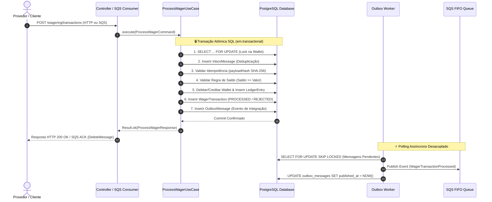

# 🦧 Processador Financeiro Distribuído de Apostas — Jungle Gaming

Bem-vindo ao repositório do **Distributed Wagering Processor**! Este projeto foi desenvolvido para o desafio técnico de Backend Developer da **Jungle Gaming**.

---

## 💡 Entendendo o Problema (Sem Complicação!)

Imagine que você está jogando em um cassino online. Você faz uma aposta de **R$ 25,00**. Nesse exato milissegundo:
1. O jogo avisa o sistema: *"Debite R$ 25,00 do jogador X"*.
2. A sua conexão de internet oscila e o jogo reenvia a mesma mensagem **3 vezes**.
3. Ao mesmo tempo, você abriu o jogo em outra aba e tentou apostar mais **R$ 80,00**, mas seu saldo inicial era de apenas **R$ 100,00**.

**O que um sistema financeiro de verdade NÃO pode deixar acontecer?**
- ❌ Não pode descontar a mesma aposta 3 vezes (Idempotência).
- ❌ Não pode deixar o saldo ficar negativo (Consistência Financeira).
- ❌ Não pode perder a conta ou calcular centavos errado (Precisão Decimal).
- ❌ Não pode travar nem dar erro se tiverem 10.000 pessoas jogando juntas (Concorrência & Resiliência).

Este projeto é a solução para esse problema: um **microserviço financeiro distribuído**, resiliente a falhas e pronto para rodar em produção em múltiplos servidores simultâneos.

---

## 🔄 Fluxo de Dados e Transacionalidade Atômica

O diagrama abaixo ilustra o ciclo de vida completo de uma transação de aposta, desde a chegada da requisição até a persistência atômica no banco e a publicação assíncrona do evento:



---

## 🎯 As 4 Regras de Ouro do Sistema

1. **Moeda de Verdade (`Money`)**: Dinheiro não é float nem number. É sempre tratado como texto decimal exato com 2 casas (`"25.00"`), sem arredondamentos estranhos do JavaScript.
2. **Ledger Auditável (Extrato Bancário)**: Nenhuma alteração de saldo acontece "do nada". Toda entrada ou saída gera um lançamento imutável de extrato (`DEBIT` ou `CREDIT`) que prova de onde veio e para onde foi o dinheiro.
3. **Idempotência Garantida (Sem Cobrança Dupla)**: Cada operação tem um identificador único. Se a mensagem chegar 50 vezes seguidas, o sistema processa a primeira e responde exatamente a mesma resposta para as outras 49, sem descontar o saldo de novo.
4. **Proteção Contra Corridas (Pessimistic Locking)**: Quando duas apostas tentam mexer no saldo do mesmo jogador ao mesmo tempo, o banco de dados enfileira e resolve uma por uma com trava de linha (`SELECT FOR UPDATE`), impedindo que o saldo fique negativo.

---

## 🚀 Como Rodar o Projeto

Você não precisa instalar bancos ou filas na sua máquina local! Tudo roda dentro do **Docker**.

### Pré-requisitos
- [Docker](https://www.docker.com/) e Docker Compose instalados.
- [Bun 1.x](https://bun.sh/) (opcional, caso queira rodar testes fora do container).

### 1. Subindo a Aplicação em 3 Instâncias Simultâneas

Execute o comando abaixo na raiz do projeto:

```bash
docker compose up --build --scale app=3
```

Esse comando vai subir:
- 🐘 **PostgreSQL 16**: O banco de dados com todas as restrições financeiras ativas.
- 📬 **LocalStack (AWS SQS)**: A fila de mensagens assíncronas FIFO (`wager-transactions.fifo`).
- ⚡ **3 Instâncias da Aplicação NestJS**: Testando na prática o comportamento distribuído na porta `3000`.

### 2. Rodando Localmente para Desenvolvimento (Opcional)

Se quiser subir apenas o banco e a fila para desenvolver na sua máquina:

```bash
# 1. Subir banco e fila
docker compose up postgres localstack -d

# 2. Instalar dependências
bun install

# 3. Rodar as migrações do banco
bun run migration:up

# 4. Iniciar o servidor em modo de desenvolvimento
bun run start:dev
```

---

## 🛠️ Plano de Execução por Fases

A construção do projeto foi dividida em fases bem definidas para garantir isolamento e alta qualidade:

### 🔹 Fase 1: Domain Core & Value Objects
- **Precisão Financeira (`Money`)**: Classe atômica baseada em `decimal.js` com escala fixa (2 casas decimais) e serialização rigorosa em string (`"25.00"`).
- **Entidades de Domínio Encapsuladas**: Construtores privados e factories estáticas (`open`, `create`, `rehydrate`) em `Wallet`, `WagerTransaction` e `WalletLedgerEntry`.
- **Envelopes Tipados de Eventos**: Subclasses concretas de `IntegrationEvent<T>` (`WalletBalanceChanged`, `WagerTransactionProcessed`, `WagerTransactionRejected`, `WagerTransactionPendingReference`).

### 🔹 Fase 2: Aplicação & Casos de Uso
- **`ProcessWagerUseCase`**: Fluxo principal manipulando apostas (`BET`), ganhos (`WIN`), derrotas (`LOSS`), estornos (`REFUND`) e reversões (`ROLLBACK`).
- **`OpenWalletUseCase` & `ReconcileWalletUseCase`**: Criação de carteiras com transação interna `OPENING` e auditoria em tempo real comparando extrato vs saldo.

### 🔹 Fase 3: Infraestrutura & Persistência MikroORM
- **Schema PostgreSQL & Constraints**: Locks pessimistas (`SELECT FOR UPDATE`), restrições `CHECK (balance >= 0)`, `CHECK (balance_after >= 0)` e chaves compostas/únicas.
- **Unit of Work & Migrações**: `DatabaseUnitOfWork` gerenciando a transação atômica SQL.

### 🔹 Fase 4: Mensageria & Transactional Outbox
- **Deduplicação via Inbox**: Registro em `inbox_messages` garantindo at-least-once com ACK somente pós-commit.
- **Outbox Worker**: Polling desacoplado via `SELECT FOR UPDATE SKIP LOCKED` enviando eventos ao SQS FIFO (`LocalStack`).

### 🔹 Fase 5: Testes de Concorrência & Observabilidade
- **Suíte de Testes**: 50 requisições simultâneas, disputa de saldo, métricas Prometheus e endpoints de saúde.

---

Criamos uma suíte de testes completa, incluindo cenários reais de estresse financeiro e concorrência:

```bash
# Rodar testes unitários (Money, Wallet, Transações)
bun test tests/unit

# Rodar os testes de Concorrência (50 requisições simultâneas e disputa de saldo)
bun test tests/concurrency

# Rodar todos os testes do projeto
bun test tests/
```

> **Cenário de Teste de Concorrência Incluído**:
> 1. Um saldo inicial de **R$ 100,00**.
> 2. Duas apostas simultâneas de **R$ 80,00** disputando o saldo ao mesmo tempo.
> 3. **Resultado**: Exatamente 1 aposta é APROVADA (saldo final R$ 20,00) e a outra é REJEITADA por saldo insuficiente, gerando exatamente 1 lançamento de extrato.

---

## 📂 Organização do Código (Estrutura de Diretórios)

O projeto segue a **Arquitetura Hexagonal (Ports & Adapters)**. O objetivo é manter o coração do negócio (as regras de dinheiro e carteira) totalmente isolado de bancos de dados ou frameworks como NestJS.

```
DistributedWageringProcessor/
├── 📁 src/                             # Código-fonte da aplicação (Hexagonal Architecture)
│   ├── 📁 core/                        # Núcleo compartilhado DDD (Domain primitives, Result, Errors)
│   │   ├── 📁 application/             # Monad funcional Result<T, E>
│   │   ├── 📁 domain/                  # ValueObject e AggregateRoot base
│   │   └── 📁 errors/                  # Hierarquia AppError, DomainError e FailureCode enum
│   ├── 📁 modules/                     # Módulos de Domínio da Aplicação
│   │   ├── 📁 messaging/               # 📬 Transacional Outbox & Inbox
│   │   │   ├── 📁 application/         # Contratos de repositório Inbox e Outbox
│   │   │   ├── 📁 domain/              # Entities InboxMessage, OutboxMessage e IntegrationEvents
│   │   │   └── 📁 infrastructure/      # Repositórios MikroORM, SQS Producer/Consumer e Poller Worker
│   │   ├── 📁 wagering/                # 🎲 Gestão de Apostas & Transações
│   │   │   ├── 📁 application/         # Use Cases (ProcessWagerUseCase, GetWagerTransactionUseCase)
│   │   │   ├── 📁 domain/              # Entity WagerTransaction, Estados e Regras por Kind
│   │   │   └── 📁 infrastructure/      # Controller HTTP, DTOs e PendingReferenceWorker
│   │   └── 📁 wallet/                  # 👛 Gestão de Carteiras & Ledger Auditável
│   │       ├── 📁 application/         # Use Cases (OpenWallet, GetWallet, GetLedger, ReconcileWallet)
│   │       ├── 📁 domain/              # Wallet Aggregate Root, Money Value Object, WalletLedgerEntry
│   │       └── 📁 infrastructure/      # Controller HTTP, DTOs, Entidades e Repositórios MikroORM
│   ├── 📁 shared/                      # Infraestrutura compartilhada da aplicação
│   │   ├── 📁 application/             # Contrato IUnitOfWork
│   │   └── 📁 infrastructure/          # Database UnitOfWork, Migrações SQL, Guard de Auth e Health/Metrics
│   └── 📄 main.ts                      # Ponto de entrada NestJS com Bootstrapping e Pipes
├── 📁 tests/                           # Suíte de Testes Automatizados
│   ├── 📁 unit/                        # Testes unitários (Money, Wallet, WagerTransaction)
│   └── 📁 concurrency/                 # Testes de concorrência e consistência financeira (50 requests em paralelo)
├── 📁 scripts/                         # Scripts de Inicialização de Containers
│   └── 📜 init-localstack.sh           # Auto-provisionamento de Filas FIFO SQS no LocalStack
├── 🐳 docker-compose.yml              # Orquestração de Containers (PostgreSQL, LocalStack, App Scaled)
├── 🐳 Dockerfile                       # Containerização usando Bun 1.x Alpine
├── ⚙️ mikro-orm.config.ts             # Configuração ORM, conexão PostgreSQL e Migrações
├── 📜 package.json                    # Dependências da aplicação e scripts de execução Bun
├── 📄 tsconfig.json                   # Configuração estrita do TypeScript e Path Aliases (@core, @modules)
├── 📖 README.md                       # Documentação didática do projeto
├── 📐 ARCHITECTURE.md                 # Documento detalhado de decisões arquiteturais e banco de dados
└── 🔒 .env.example                    # Modelo de variáveis de ambiente
```

---

## 📡 Endpoints da API

### 🏥 Saúde da Aplicação (Abertos)
- `GET /health/live`: Retorna `200 OK` se a aplicação estiver no ar.
- `GET /health/ready`: Retorna `200 OK` se o PostgreSQL e o SQS estiverem acessíveis.
- `GET /metrics`: Expõe métricas no formato Prometheus (latência, duplicatas, status das apostas).

---

### 👛 Carteiras (`/wallets`)

#### 1. Criar uma Nova Carteira
```http
POST /wallets
Content-Type: application/json
```
```json
{
  "playerId": "jogador-777",
  "initialBalance": { "amount": "1000.00", "currency": "BRL" }
}
```

#### 2. Consultar Carteira
```http
GET /wallets/:walletId
```

#### 3. Consultar Extrato (Ledger com Paginação por Cursor)
```http
GET /wallets/:walletId/ledger?limit=50
```

#### 4. Reconciliar Saldo (Auditoria em Tempo Real)
Verifica se a soma de todas as entradas e saídas do extrato bate exatamente com o saldo gravado na carteira.
```http
POST /wallets/:walletId/reconciliation
```

---

### 🎲 Apostas e Transações (`/wagering/transactions`)

#### Submeter uma Operação de Aposta
```http
POST /wagering/transactions
Idempotency-Key: provedor-a:transacao-999
Content-Type: application/json
```
```json
{
  "providerId": "provedor-a",
  "externalTransactionId": "transacao-999",
  "playerId": "jogador-777",
  "walletId": "ID-DA-CARTEIRA-AQUI",
  "roundId": "rodada-42",
  "gameId": "fortune-monkey",
  "kind": "BET",
  "money": { "amount": "25.00", "currency": "BRL" }
}
```

**Tipos de Operação (`kind`)**:
- `BET`: Aposta. Débito no saldo.
- `WIN`: Ganho. Crédito no saldo.
- `LOSS`: Derrota. Não altera o saldo (apenas registra o fim da rodada).
- `REFUND`: Estorno. Reverte uma aposta `BET` processada.
- `ROLLBACK`: Reversão completa de uma aposta, ganho ou estorno.

---

## 📑 Quer se aprofundar na Arquitetura Técnica?

Para entender em detalhes o desenho das tabelas no PostgreSQL, as restrições (`CHECK`, `UNIQUE`), o funcionamento do **Transactional Outbox** e a estratégia de travamento de linhas no banco, acesse o documento técnico completo:

👉 **[Leia o ARCHITECTURE.md](file:///p:/Git/GitHub/DistributedWageringProcessor/ARCHITECTURE.md)**
