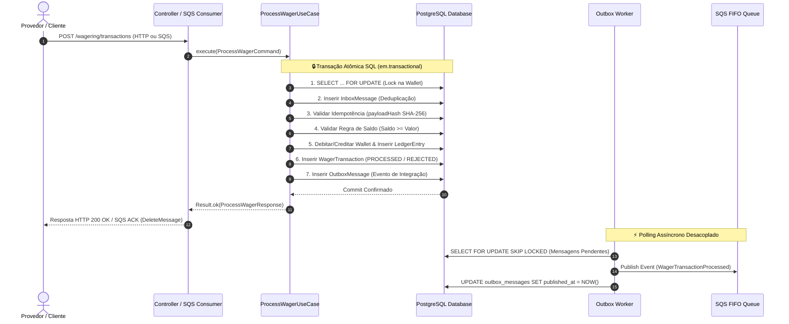

# 🦧 Processador Financeiro Distribuído de Apostas — Jungle Gaming

Bem-vindo ao repositório do **Distributed Wagering Processor**! Este projeto foi desenvolvido para o desafio técnico de Backend Developer da **Jungle Gaming**.

---

## 💡 Entendendo o Problema (Sem Complicação!)

Imagine que você está jogando em um cassino online. Você faz uma aposta de **R$ 25,00**. Nesse exato milissegundo:
1. O jogo avisa o sistema: *"Debite R$ 25,00 do jogador X"*.
2. A sua conexão de internet oscila e o jogo reenvia a mesma mensagem **3 vezes**.
3. Ao mesmo tempo, você abriu o jogo em outra aba e tentou apostar mais **R$ 80,00**, mas seu saldo inicial era de apenas **R$ 100,00**.

**O que um sistema financeiro de verdade NÃO pode deixar acontecer?**
- ❌ Não pode descontar a mesma aposta 3 vezes (Idempotência).
- ❌ Não pode deixar o saldo ficar negativo (Consistência Financeira).
- ❌ Não pode perder a conta ou calcular centavos errado (Precisão Decimal).
- ❌ Não pode travar nem dar erro se tiverem 10.000 pessoas jogando juntas (Concorrência & Resiliência).

Este projeto é a solução para esse problema: um **microserviço financeiro distribuído**, resiliente a falhas e pronto para rodar em produção em múltiplos servidores simultâneos.

---

## 🔄 Fluxo de Dados e Transacionalidade Atômica

O diagrama abaixo ilustra o ciclo de vida completo de uma transação de aposta, desde a chegada da requisição até a persistência atômica no banco e a publicação assíncrona do evento:



---

## 🌟 6 Diferenciais de Alta Engenharia Incorporados

1. **⚡ Suite Automatizada de Testes de Carga (`bun run test:load`)**: Script de benchmarking simulando cenários de *Hot Wallet* (100 requisições simultâneas na mesma conta) e injeção massiva de duplicatas, reportando RPS, p50, p95, p99 e taxa de divergência.
2. **💥 Chaos Engineering & Testes de Resiliência (`bun run test:chaos`)**: Teste de integração automatizado simulando queda de processo (`SIGKILL`) imediatamente após o commit do PostgreSQL, provando que a reentrega da mensagem passa pela Inbox sem duplicar lançamentos.
3. **📊 Double-Entry Bookkeeping (Partidas Dobradas)**: Suporte a contas contábeis (`PLAYER_LIABILITY`, `HOUSE_PLATFORM`, `PROVIDER_SETTLEMENT`). Cada transação possui lançamentos de débito e crédito estritamente balanceados.
4. **🔍 Rastreabilidade Distribuída com OpenTelemetry**: SDK de telemetria integrado para rastreamento de spans e propagação de `traceId` / `spanId`.
5. **📈 Dashboard Operacional Local (Grafana + Prometheus)**: Containers de Prometheus e Grafana pré-configurados subindo no Docker Compose com métricas em tempo real (taxa de transações, outbox lag, latência p95).
6. **📐 Documentação C4 e Diagrama de Estados (`ARCHITECTURE.md`)**: Diagramas visuais detalhados da máquina de estados da `WagerTransaction` e arquitetura C4 de contêineres.

---

## 🎯 As 4 Regras de Ouro do Sistema

1. **Moeda de Verdade (`Money`)**: Dinheiro não é float nem number. É sempre tratado como texto decimal exato com 2 casas (`"25.00"`), sem arredondamentos estranhos do JavaScript.
2. **Ledger Auditável (Extrato Bancário & Partidas Dobradas)**: Toda entrada ou saída gera lançamentos imutáveis de extrato balanceados entre contas de passivo e receita.
3. **Idempotência Garantida (Sem Cobrança Dupla)**: Cada operação tem um identificador único. Se a mensagem chegar 50 vezes seguidas, o sistema processa a primeira e responde exatamente a mesma resposta para as outras 49, sem descontar o saldo de novo.
4. **Proteção Contra Corridas (Pessimistic Locking)**: Quando duas apostas tentam mexer no saldo do mesmo jogador ao mesmo tempo, o banco de dados enfileira e resolve uma por uma com trava de linha (`SELECT FOR UPDATE`), impedindo que o saldo fique negativo.

---

## 🚀 Como Rodar o Projeto

Você não precisa instalar bancos ou filas na sua máquina local! Tudo roda dentro do **Docker**.

### 1. Subindo a Aplicação + Prometheus + Grafana

Execute o comando abaixo na raiz do projeto:

```bash
docker compose up --build --scale app=3
```

Esse comando vai subir:
- 🐘 **PostgreSQL 16**: O banco de dados com todas as restrições financeiras ativas na porta `5432`.
- 📬 **LocalStack (AWS SQS)**: A fila de mensagens assíncronas FIFO (`wager-transactions.fifo`) na porta `4566`.
- ⚡ **3 Instâncias da Aplicação NestJS**: Executando com load balancing na porta `3000`.
- 📊 **Prometheus**: Coletor de métricas na porta `9090`.
- 📈 **Grafana Dashboard**: Painel operacional em tempo real na porta `3001` (Login: `admin` / `admin`).

---

## 🧪 Suíte de Testes & Benchmark

```bash
# Testes Unitários (Money, Wallet, Transações)
bun test tests/unit

# Testes de Concorrência Real (50 requisições simultâneas e disputa de saldo)
bun test tests/concurrency

# Teste de Chaos Engineering (Simulação de crash pós-commit pré-ACK)
bun test:chaos

# Teste de Carga e Benchmark (100 requisições simultâneas + Reconciliação)
bun run test:load

# Executar Todos os Testes
bun test tests/
```

---

## 📂 Organização do Código (Estrutura de Diretórios)

```
DistributedWageringProcessor/
├── 📁 src/                             # Código-fonte da aplicação (Hexagonal Architecture)
│   ├── 📁 core/                        # Núcleo compartilhado DDD (Domain primitives, Result, Errors)
│   │   ├── 📁 application/             # Monad funcional Result<T, E>
│   │   ├── 📁 domain/                  # ValueObject e AggregateRoot base
│   │   └── 📁 errors/                  # Hierarquia AppError, DomainError e FailureCode enum
│   ├── 📁 modules/                     # Módulos de Domínio da Aplicação
│   │   ├── 📁 messaging/               # 📬 Transacional Outbox & Inbox
│   │   │   ├── 📁 application/         # Contratos de repositório Inbox e Outbox
│   │   │   ├── 📁 domain/              # Entities InboxMessage, OutboxMessage e IntegrationEvents
│   │   │   └── 📁 infrastructure/      # Repositórios MikroORM, SQS Producer/Consumer e Poller Worker
│   │   ├── 📁 wagering/                # 🎲 Gestão de Apostas & Transações
│   │   │   ├── 📁 application/         # Use Cases (ProcessWagerUseCase, GetWagerTransactionUseCase)
│   │   │   ├── 📁 domain/              # Entity WagerTransaction, Estados e Regras por Kind
│   │   │   └── 📁 infrastructure/      # Controller HTTP, DTOs e PendingReferenceWorker
│   │   └── 📁 wallet/                  # 👛 Gestão de Carteiras & Ledger Auditável
│   │       ├── 📁 application/         # Use Cases (OpenWallet, GetWallet, GetLedger, ReconcileWallet)
│   │       ├── 📁 domain/              # Wallet Aggregate Root, Money Value Object, WalletLedgerEntry
│   │       └── 📁 infrastructure/      # Controller HTTP, DTOs, Entidades e Repositórios MikroORM
│   ├── 📁 shared/                      # Infraestrutura compartilhada da aplicação
│   │   ├── 📁 application/             # Contrato IUnitOfWork
│   │   └── 📁 infrastructure/          # Database UnitOfWork, Migrações SQL, Telemetria OpenTelemetry, Guard e Health
│   └── 📄 main.ts                      # Ponto de entrada NestJS com Bootstrapping e Pipes
├── 📁 tests/                           # Suíte de Testes Automatizados
│   ├── 📁 unit/                        # Testes unitários (Money, Wallet, WagerTransaction)
│   ├── 📁 integration/                 # Testes de integração e Chaos Engineering (chaos.test.ts)
│   └── 📁 concurrency/                 # Testes de concorrência e consistência financeira
├── 📁 scripts/                         # Scripts de Automação & Load Test
│   ├── 📜 load-test.ts                 # Script de benchmarking e estresse de carga (bun run test:load)
│   └── 📜 init-localstack.sh           # Auto-provisionamento de Filas FIFO SQS no LocalStack
├── 📁 docker/                          # Configurações de Monitoramento
│   ├── 📁 grafana/                     # Provisionamento de Dashboards Grafana
│   └── 📜 prometheus.yml               # Configuração do Prometheus Metrics Scraper
├── 🐳 docker-compose.yml              # Orquestração de Containers (Postgres, LocalStack, App, Prometheus, Grafana)
├── 🐳 Dockerfile                       # Containerização usando Bun 1.x Alpine
├── ⚙️ mikro-orm.config.ts             # Configuração ORM, conexão PostgreSQL e Migrações
├── 📜 package.json                    # Dependências da aplicação e scripts de execução Bun
├── 📄 tsconfig.json                   # Configuração estrita do TypeScript e Path Aliases (@core, @modules)
├── 📖 README.md                       # Documentação didática do projeto
├── 📐 ARCHITECTURE.md                 # Documento detalhado de decisões arquiteturais, C4 e banco de dados
└── 🔒 .env.example                    # Modelo de variáveis de ambiente
```

---

## 📑 Quer se aprofundar na Arquitetura Técnica?

Para entender em detalhes o desenho das tabelas no PostgreSQL, os diagramas de estado C4, o funcionamento do **Transactional Outbox**, OpenTelemetry e os resultados dos benchmarks:

👉 **[Leia o ARCHITECTURE.md](file:///p:/Git/GitHub/DistributedWageringProcessor/ARCHITECTURE.md)**
