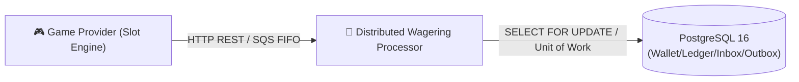
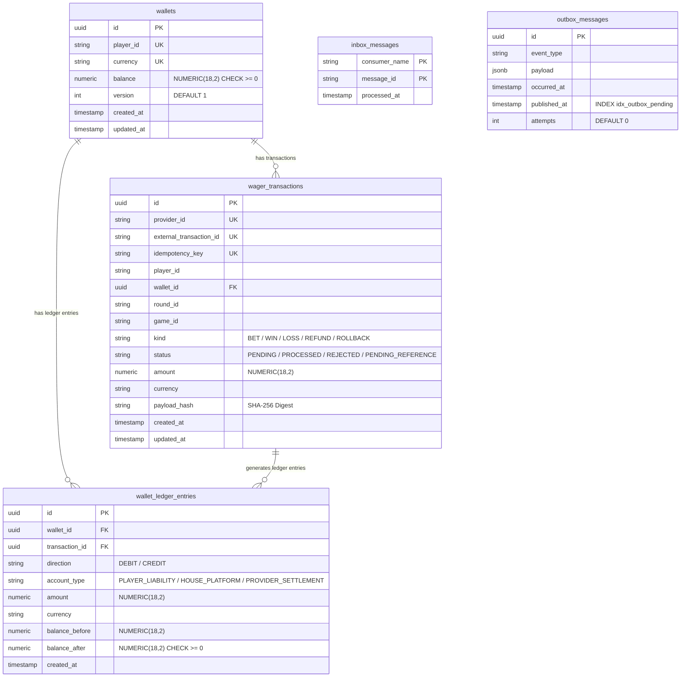

# 00 — System Overview

## 1. Business Context

---

## 2. The Distributed Systems Challenge

> [!WARNING]
> In a high-concurrency environment with thousands of simultaneous bettors, the system faces 4 major challenges:

1. **Redelivery & Redundancy**: Messages can be delivered **more than once** (*at-least-once*) due to network flakiness.
2. **Out-of-Order Delivery**: A request for a refund (`REFUND`) or reversal (`ROLLBACK`) may arrive at the system **before** the original bet (`BET`).
3. **Concurrent Balance Contention (*Hot Wallet*)**: Multiple game tabs or parallel requests may try to debit the balance of the same wallet in the exact same millisecond.
4. **Infrastructure Outages**: The application server may crash immediately after writing the transaction to the database, but before acknowledging message consumption to the broker (*SQS ACK*).

---

## 3. PostgreSQL Database Model (`erDiagram`)

The relational diagram below illustrates the structure of the 5 PostgreSQL tables along with their primary keys and relationships:

---

## 4. Inviolable Global Invariants

> [!IMPORTANT]
> Financial consistency rules are guaranteed natively and strictly within the PostgreSQL schema itself:

| Invariant | Description | Enforcement Mechanism |
|---|---|---|
| **Financial Precision** | Absolute prohibition of floating-point types (`number`/`float`). Money is treated as exact decimal strings. | `Money` Class using `Decimal.js` and SQL column `NUMERIC(18,2)`. |
| **Non-Negative Balance** | The wallet balance can never become negative, even under simultaneous concurrent disputes. | `CONSTRAINT check_non_negative_balance CHECK (balance >= 0)`. |
| **Auditable Ledger** | Every financial movement requires a balanced ledger entry between liability and revenue accounts. | Immutable `WalletLedgerEntry` and `CONSTRAINT check_ledger_arithmetic`. |
| **Persistent Idempotency** | Re-sending the same request with the same key returns the original result without duplicating credits or debits. | Unique constraint `(provider_id, idempotency_key)` and `inbox_messages` table. |
