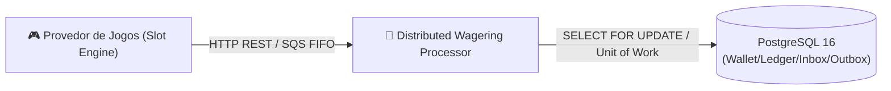
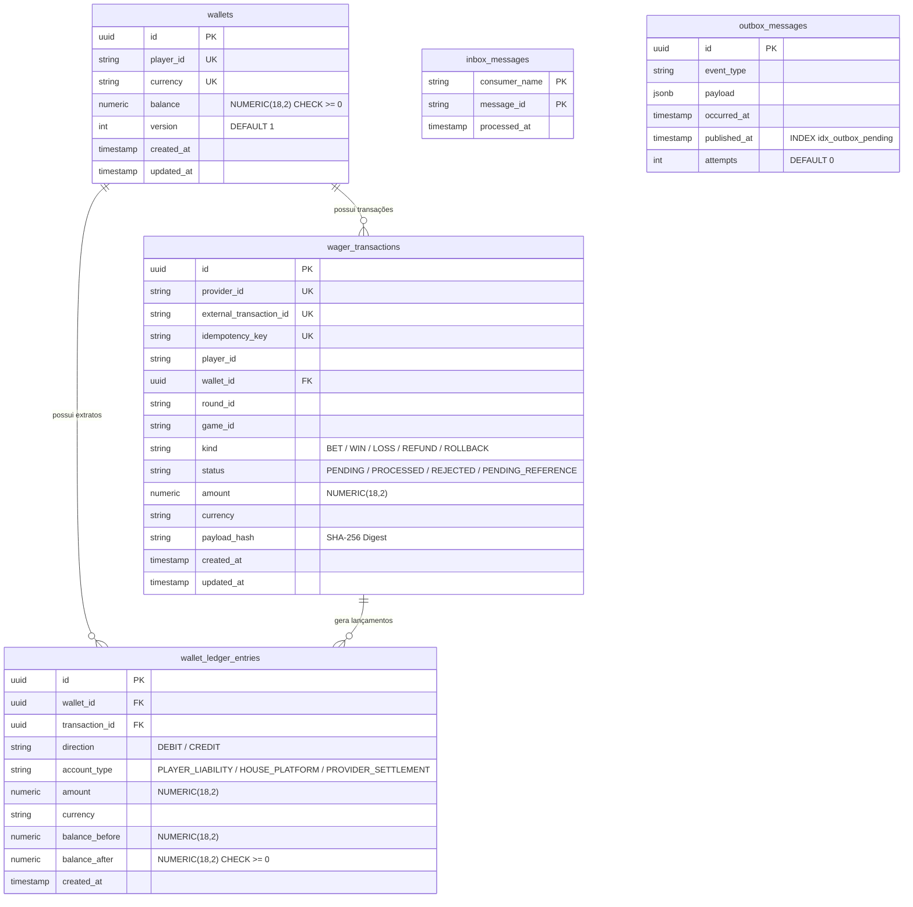

# 00 — Visão Geral do Sistema

## 1. O Contexto de Negócio

---

## 2. O Desafio de Sistemas Distribuídos

> [!WARNING]
> Em um ambiente de alta concorrência com milhares de apostadores simultâneos, o sistema enfrenta 4 grandes desafios:

1. **Redelivery & Redundância**: Mensagens podem ser entregues **mais de uma vez** (*at-least-once*) por oscilações de rede.
2. **Entregas Fora de Ordem**: Um pedido de estorno (`REFUND`) ou reversão (`ROLLBACK`) pode chegar ao sistema **antes** da aposta original (`BET`).
3. **Disputa de Saldo Concorrente (*Hot Wallet*)**: Múltiplas abas de jogos ou requisições paralelas podem tentar debitar o saldo da mesma carteira no mesmo milissegundo.
4. **Quedas de Infraestrutura**: O servidor de aplicação pode sofrer uma falha (*crash*) exatamente após gravar a transação no banco de dados, mas antes de confirmar a leitura da mensagem no broker (*SQS ACK*).

---

## 3. Modelo do Banco de Dados PostgreSQL (`erDiagram`)

O diagrama relacional abaixo ilustra a estrutura das 5 tabelas no PostgreSQL com suas chaves primárias e relacionamentos:

---

## 4. As Invariantes Globais Invioláveis

> [!IMPORTANT]
> As regras de consistência financeira são garantidas de forma nativa e inviolável no próprio schema do PostgreSQL:

| Invariante | Descrição | Como é Garantido |
|---|---|---|
| **Precisão Financeira** | Proibição absoluta do uso de tipos flutuantes (`number`/`float`). Dinheiro é tratado como string decimal exata. | Class `Money` com `Decimal.js` e coluna SQL `NUMERIC(18,2)`. |
| **Saldo Não-Negativo** | O saldo da carteira nunca pode ficar negativo, mesmo sob disputas concorrentes simultâneas. | `CONSTRAINT check_non_negative_balance CHECK (balance >= 0)`. |
| **Ledger Auditável** | Toda movimentação financeira exige um lançamento no extrato balanceado entre contas de passivo e receita. | `WalletLedgerEntry` imutável e `CONSTRAINT check_ledger_arithmetic`. |
| **Idempotência Persistente** | Reenviar a mesma requisição com a mesma chave responde o resultado original sem duplicar créditos ou débitos. | Unique constraint `(provider_id, idempotency_key)` e tabela `inbox_messages`. |
