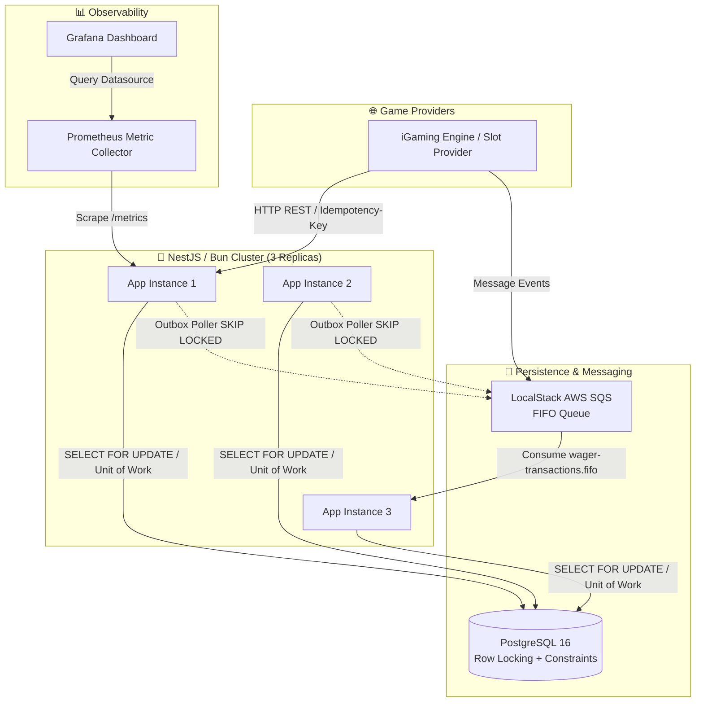
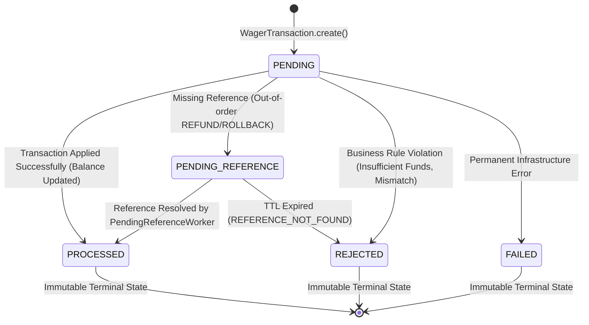

# 01 — System Architecture & Diagrams 📐

## 1. Hexagonal Architecture (Ports and Adapters)

The system adopts **Hexagonal Architecture** to completely decouple the business domain from the NestJS framework, MikroORM, and SQS messaging drivers.

```
src/
├── core/                         # Shared primitives (Domain, Application, Errors)
├── modules/
│   ├── wallet/                   # 👛 Wallet Domain, Balance, and Ledger
│   ├── wagering/                 # 🎲 Wagering Transaction Domain (BET, WIN, LOSS, etc.)
│   └── messaging/                # 📬 Transactional Outbox and Inbox Pattern
└── shared/
    └── infrastructure/           # Unit of Work, SQL Migrations, Auth Guards, Telemetry
```

> [!NOTE]
> **Framework Isolation**: Domain logic (`Money`, `Wallet`, `WagerTransaction`, `WalletLedgerEntry`) contains zero imports from web frameworks or ORMs. All IO interactions are mediated by interfaces (Ports) in the application layer.

---

## 2. C4 Container Diagram



---

## 3. Transaction State Machine Diagram (`WagerTransaction`)



> [!IMPORTANT]
> **Immutability of Terminal States**: The `PROCESSED`, `REJECTED`, and `FAILED` states are strictly immutable. Once transitioned to one of these states, no further state changes can occur on the same transaction.
