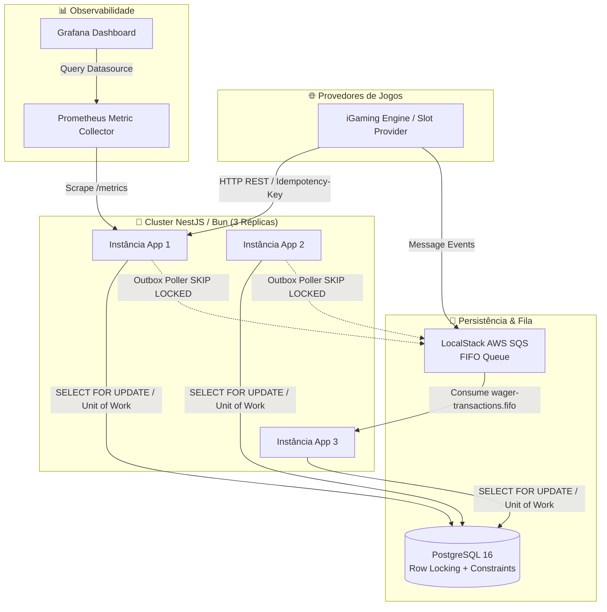
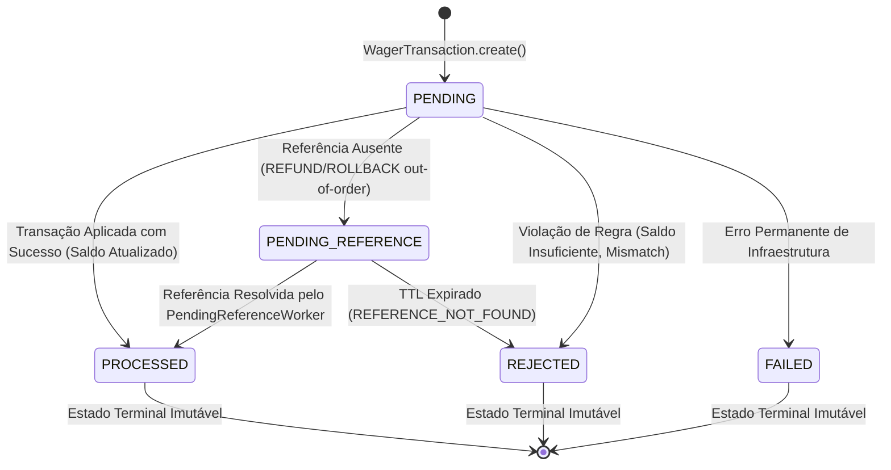

# 01 — Arquitetura do Sistema & Diagramas 📐

## 1. Arquitetura Hexagonal (Ports and Adapters)

O sistema adota **Hexagonal Architecture** para isolar completamente o domínio de negócio em relação ao framework NestJS, ao ORM MikroORM e aos drivers de mensageria SQS.

```
src/
├── core/                         # Primitivas compartilhadas (Domain, Application, Errors)
├── modules/
│   ├── wallet/                   # 👛 Domínio da Carteira, Saldo e Extrato
│   ├── wagering/                 # 🎲 Domínio das Transações de Aposta (BET, WIN, LOSS, etc.)
│   └── messaging/                # 📬 Transactional Outbox e Inbox Pattern
└── shared/
    └── infrastructure/           # Unit of Work, Migrações SQL, Guardas de Auth e Telemetria
```

### Camadas e Suas Responsabilidades:
1. **Domínio (`domain/`)**: Regras de negócio puras (`Money`, `Wallet`, `WagerTransaction`, `WalletLedgerEntry`). Sem dependências externas.
2. **Aplicação (`application/`)**: Casos de uso (`ProcessWagerUseCase`, `OpenWalletUseCase`) e contratos de repositório (Ports).
3. **Infraestrutura (`infrastructure/`)**: Implementações concretas de repositórios MikroORM, Controllers HTTP e Consumidores SQS (Adapters).

---

## 2. Diagrama C4 de Contêineres



---

## 3. Diagrama de Estados da Transação (`WagerTransaction`)


