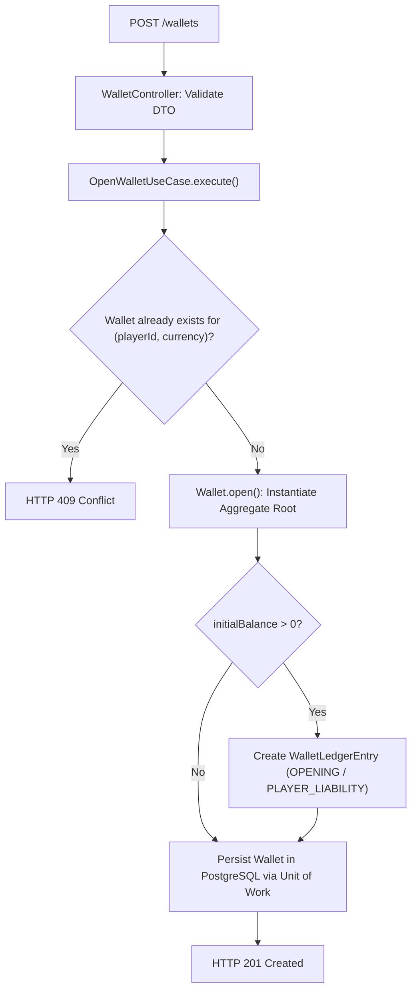
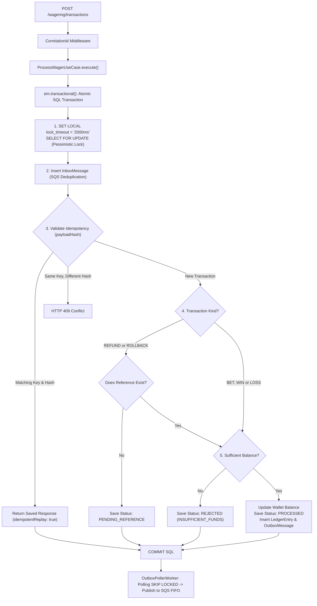
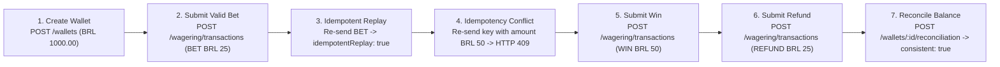

# 02 — Complete API Specification, Payloads & Execution Flows 📡

## 1. Wallet Endpoints (`/wallets`)

### `POST /wallets` — Create Wallet
Creates a new wallet for the player. If `initialBalance` is greater than zero, it generates an internal `OPENING` transaction with a credit ledger entry.

#### Internal Execution Flow:



#### Request Body:
```json
{
  "playerId": "0192f28f-5dc0-7d58-bdb2-814ad6a0f4a1",
  "initialBalance": {
    "amount": "1000.00",
    "currency": "BRL"
  }
}
```

#### Response Success (`201 Created`):
```json
{
  "id": "0192f291-27dd-7d3f-8071-5f8685deef37",
  "playerId": "0192f28f-5dc0-7d58-bdb2-814ad6a0f4a1",
  "balance": {
    "amount": "1000.00",
    "currency": "BRL"
  },
  "version": 1
}
```

#### Response Error (`409 Conflict`):
```json
{
  "error": "Wallet already exists for playerId '0192f28f-5dc0-7d58-bdb2-814ad6a0f4a1' and currency 'BRL'"
}
```

---

### `GET /wallets/:walletId` — Fetch Wallet Details
Returns the current state of the wallet and its accumulated balance.

#### Response Success (`200 OK`):
```json
{
  "id": "0192f291-27dd-7d3f-8071-5f8685deef37",
  "playerId": "0192f28f-5dc0-7d58-bdb2-814ad6a0f4a1",
  "currency": "BRL",
  "balance": {
    "amount": "975.00",
    "currency": "BRL"
  },
  "version": 2,
  "createdAt": "2026-08-21T15:00:00.000Z",
  "updatedAt": "2026-08-21T15:01:00.000Z"
}
```

---

### `GET /wallets/:walletId/ledger` — Fetch Paginated Ledger Entries
Returns the immutable accounting ledger entries of the wallet using opaque cursor-based pagination.

#### Response Success (`200 OK`):
```json
{
  "entries": [
    {
      "id": "0192f298-5555-7d3f-8071-5f8685deef00",
      "walletId": "0192f291-27dd-7d3f-8071-5f8685deef37",
      "transactionId": "0192f298-345e-7e38-af88-e43f851a819d",
      "direction": "DEBIT",
      "accountType": "PLAYER_LIABILITY",
      "money": { "amount": "25.00", "currency": "BRL" },
      "balanceBefore": { "amount": "1000.00", "currency": "BRL" },
      "balanceAfter": { "amount": "975.00", "currency": "BRL" },
      "createdAt": "2026-08-21T15:01:00.000Z"
    }
  ],
  "nextCursor": "2026-08-21T15:01:00.000Z"
}
```

---

### `POST /wallets/:walletId/reconciliation` — Reconcile Wallet Balance
Compares the stored balance in the `wallets` table against the recalculated sum of all `wallet_ledger_entries`.

#### Response Success (`200 OK`):
```json
{
  "walletId": "0192f291-27dd-7d3f-8071-5f8685deef37",
  "storedBalance": { "amount": "975.00", "currency": "BRL" },
  "calculatedBalance": { "amount": "975.00", "currency": "BRL" },
  "difference": { "amount": "0.00", "currency": "BRL" },
  "consistent": true,
  "checkedEntries": 42
}
```

---

## 2. Wagering Transaction Endpoints (`/wagering/transactions`)

### `POST /wagering/transactions` — Submit Wager Transaction

#### Internal Execution Flow (🔒 Atomic PostgreSQL Transaction):



#### Mandatory Headers:
- `Idempotency-Key`: Provider idempotency identifier (e.g., `"provider-a:tx-123"`).

#### Request Body:
```json
{
  "providerId": "provider-a",
  "externalTransactionId": "transaction-123",
  "playerId": "0192f28f-5dc0-7d58-bdb2-814ad6a0f4a1",
  "walletId": "0192f291-27dd-7d3f-8071-5f8685deef37",
  "roundId": "round-987",
  "gameId": "fortune-chimp",
  "kind": "BET",
  "money": { "amount": "25.00", "currency": "BRL" }
}
```

#### Response Success — Processed Bet (`200 OK`):
```json
{
  "transactionId": "0192f298-345e-7e38-af88-e43f851a819d",
  "status": "PROCESSED",
  "balance": { "amount": "975.00", "currency": "BRL" },
  "idempotentReplay": false
}
```

#### Response Success — Idempotent Replay (`200 OK`):
```json
{
  "transactionId": "0192f298-345e-7e38-af88-e43f851a819d",
  "status": "PROCESSED",
  "balance": { "amount": "975.00", "currency": "BRL" },
  "idempotentReplay": true
}
```

#### Response Success — Rejected Bet by Business Rule (`200 OK`):
```json
{
  "transactionId": "0192f298-9999-7e38-af88-e43f851a819d",
  "status": "REJECTED",
  "balance": { "amount": "10.00", "currency": "BRL" },
  "idempotentReplay": false,
  "failureCode": "INSUFFICIENT_FUNDS"
}
```

#### Response Error — Idempotency Conflict (`409 Conflict`):
```json
{
  "error": "Idempotency key provided with conflicting payload"
}
```

---

## 3. Step-by-Step Development Testing Walkthrough 🧪



---

## 4. Failure Code Reference Table (`FailureCode`)

| Code | Description |
|---|---|
| `INSUFFICIENT_FUNDS` | Wallet balance is insufficient to process the wager debit. |
| `CURRENCY_MISMATCH` | Transaction currency differs from wallet currency. |
| `INVALID_AMOUNT` | Invalid monetary value (NaN, negative, or more than 2 decimal places). |
| `DUPLICATE_TRANSACTION` | Transaction with the same external key has already been registered. |
| `REFERENCE_NOT_FOUND` | Transaction referenced in `REFUND`/`ROLLBACK` does not exist. |
| `INVALID_REFERENCE_KIND` | `REFUND` can only reference `BET`; `ROLLBACK` can only revert `BET`, `WIN`, or `REFUND`. |
| `ALREADY_REFUNDED` | The original transaction has already been refunded previously. |
| `REFERENCE_MISMATCH` | Refund amount differs from original transaction amount. |
| `NEGATIVE_BALANCE_REVERSAL` | Win reversal would result in a negative balance. |
| `IDEMPOTENCY_PAYLOAD_MISMATCH` | Same idempotency key used with conflicting payload. |
