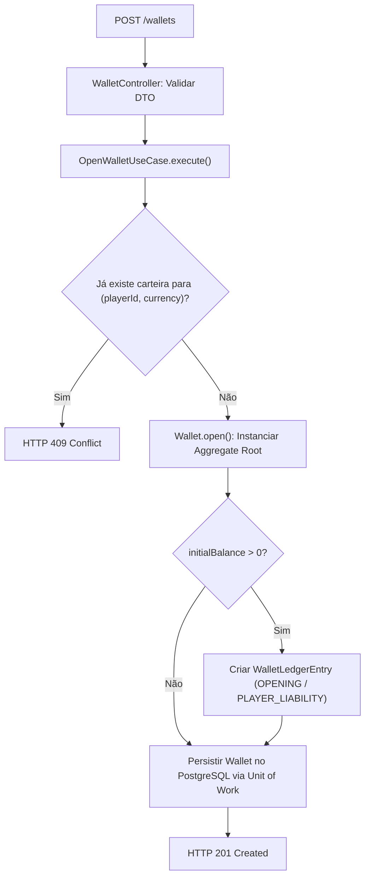
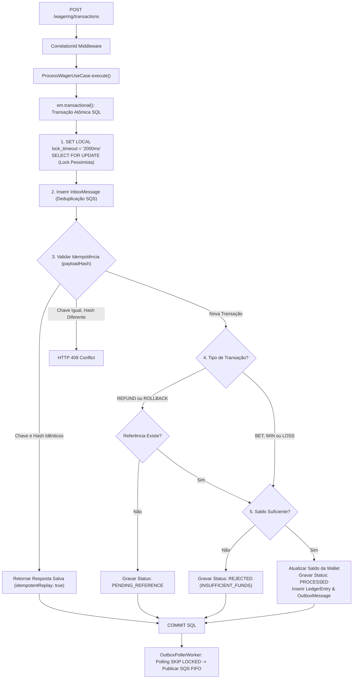
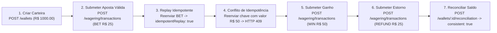

# 02 — Especificação Completa da API, Payloads & Fluxos de Execução 📡

## 1. Endpoints de Carteira (`/wallets`)

### `POST /wallets` — Criar Carteira
Cria uma nova carteira para o jogador. Se `initialBalance` for maior que zero, gera uma transação interna `OPENING` com lançamento de crédito no extrato.

#### Fluxo de Execução Interno:



#### Request Body:
```json
{
  "playerId": "0192f28f-5dc0-7d58-bdb2-814ad6a0f4a1",
  "initialBalance": {
    "amount": "1000.00",
    "currency": "BRL"
  }
}
```

#### Response Success (`201 Created`):
```json
{
  "id": "0192f291-27dd-7d3f-8071-5f8685deef37",
  "playerId": "0192f28f-5dc0-7d58-bdb2-814ad6a0f4a1",
  "balance": {
    "amount": "1000.00",
    "currency": "BRL"
  },
  "version": 1
}
```

#### Response Error (`409 Conflict`):
```json
{
  "error": "Wallet already exists for playerId '0192f28f-5dc0-7d58-bdb2-814ad6a0f4a1' and currency 'BRL'"
}
```

---

### `GET /wallets/:walletId` — Consultar Carteira
Retorna o estado atual da carteira e seu saldo acumulado.

#### Response Success (`200 OK`):
```json
{
  "id": "0192f291-27dd-7d3f-8071-5f8685deef37",
  "playerId": "0192f28f-5dc0-7d58-bdb2-814ad6a0f4a1",
  "currency": "BRL",
  "balance": {
    "amount": "975.00",
    "currency": "BRL"
  },
  "version": 2,
  "createdAt": "2026-08-21T15:00:00.000Z",
  "updatedAt": "2026-08-21T15:01:00.000Z"
}
```

---

### `GET /wallets/:walletId/ledger` — Consultar Extrato Paginado
Retorna os lançamentos contábeis imutáveis da carteira com paginação baseada em cursor opaco.

#### Response Success (`200 OK`):
```json
{
  "entries": [
    {
      "id": "0192f298-5555-7d3f-8071-5f8685deef00",
      "walletId": "0192f291-27dd-7d3f-8071-5f8685deef37",
      "transactionId": "0192f298-345e-7e38-af88-e43f851a819d",
      "direction": "DEBIT",
      "accountType": "PLAYER_LIABILITY",
      "money": { "amount": "25.00", "currency": "BRL" },
      "balanceBefore": { "amount": "1000.00", "currency": "BRL" },
      "balanceAfter": { "amount": "975.00", "currency": "BRL" },
      "createdAt": "2026-08-21T15:01:00.000Z"
    }
  ],
  "nextCursor": "2026-08-21T15:01:00.000Z"
}
```

---

### `POST /wallets/:walletId/reconciliation` — Reconciliar Saldo
Compara o saldo gravado na tabela `wallets` com o resultado do cálculo do extrato `wallet_ledger_entries`.

#### Response Success (`200 OK`):
```json
{
  "walletId": "0192f291-27dd-7d3f-8071-5f8685deef37",
  "storedBalance": { "amount": "975.00", "currency": "BRL" },
  "calculatedBalance": { "amount": "975.00", "currency": "BRL" },
  "difference": { "amount": "0.00", "currency": "BRL" },
  "consistent": true,
  "checkedEntries": 42
}
```

---

## 2. Endpoints de Transação de Apostas (`/wagering/transactions`)

### `POST /wagering/transactions` — Submeter Transação

#### Fluxo de Execução Interno (🔒 Transação Atômica PostgreSQL):



#### Headers Obligatórios:
- `Idempotency-Key`: Identificador de idempotência do provedor (ex.: `"provider-a:tx-123"`).

#### Request Body:
```json
{
  "providerId": "provider-a",
  "externalTransactionId": "transaction-123",
  "playerId": "0192f28f-5dc0-7d58-bdb2-814ad6a0f4a1",
  "walletId": "0192f291-27dd-7d3f-8071-5f8685deef37",
  "roundId": "round-987",
  "gameId": "fortune-chimp",
  "kind": "BET",
  "money": { "amount": "25.00", "currency": "BRL" }
}
```

#### Response Success — Aposta Processada (`200 OK`):
```json
{
  "transactionId": "0192f298-345e-7e38-af88-e43f851a819d",
  "status": "PROCESSED",
  "balance": { "amount": "975.00", "currency": "BRL" },
  "idempotentReplay": false
}
```

#### Response Success — Replay Idempotente (`200 OK`):
```json
{
  "transactionId": "0192f298-345e-7e38-af88-e43f851a819d",
  "status": "PROCESSED",
  "balance": { "amount": "975.00", "currency": "BRL" },
  "idempotentReplay": true
}
```

#### Response Success — Aposta Rejeitada por Negócio (`200 OK`):
```json
{
  "transactionId": "0192f298-9999-7e38-af88-e43f851a819d",
  "status": "REJECTED",
  "balance": { "amount": "10.00", "currency": "BRL" },
  "idempotentReplay": false,
  "failureCode": "INSUFFICIENT_FUNDS"
}
```

#### Response Error — Conflito de Idempotência (`409 Conflict`):
```json
{
  "error": "Idempotency key provided with conflicting payload"
}
```

---

## 3. Roteiro Passo a Passo de Testes de Desenvolvimento 🧪



---

## 4. Tabela de Códigos de Falha (`FailureCode`)

| Código | Descrição |
|---|---|
| `INSUFFICIENT_FUNDS` | Saldo insuficiente para realizar o débito de aposta. |
| `CURRENCY_MISMATCH` | A moeda da transação difere da moeda da carteira. |
| `INVALID_AMOUNT` | Valor monetário inválido (NaN, negativo ou mais de 2 casas). |
| `DUPLICATE_TRANSACTION` | Transação com a mesma chave externa já registrada. |
| `REFERENCE_NOT_FOUND` | Transação referenciada em `REFUND`/`ROLLBACK` não existe. |
| `INVALID_REFERENCE_KIND` | `REFUND` só pode referenciar `BET`; `ROLLBACK` só reverte `BET`, `WIN` ou `REFUND`. |
| `ALREADY_REFUNDED` | A transação original já foi estornada anteriormente. |
| `REFERENCE_MISMATCH` | O valor do estorno difere do valor da transação original. |
| `NEGATIVE_BALANCE_REVERSAL` | Reversão de ganho que deixaria o saldo negativo. |
| `IDEMPOTENCY_PAYLOAD_MISMATCH` | Mesma chave de idempotência usada com payload diferente. |
