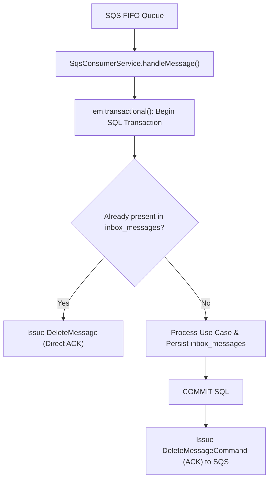

# 03 — Messaging, SQS FIFO & Outbox Pattern 📬

## 1. SQS Message Structure

Messages are dispatched to the SQS FIFO queue `wager-transactions.fifo` using `MessageGroupId = walletId` and `MessageDeduplicationId = idempotencyKey`.

```json
{
  "messageId": "msg-123-abc",
  "type": "WagerTransactionRequested",
  "occurredAt": "2026-08-21T15:00:00.000Z",
  "correlationId": "corr-uuid-999",
  "data": {
    "providerId": "provider-a",
    "externalTransactionId": "transaction-123",
    "idempotencyKey": "provider-a:transaction-123",
    "playerId": "0192f28f-5dc0-7d58-bdb2-814ad6a0f4a1",
    "walletId": "0192f291-27dd-7d3f-8071-5f8685deef37",
    "roundId": "round-987",
    "gameId": "fortune-chimp",
    "kind": "BET",
    "money": { "amount": "25.00", "currency": "BRL" }
  }
}
```

---

## 2. Inbox Pattern & Post-Commit Confirmation (ACK)

> [!IMPORTANT]
> **Strict Confirmation Order**: SQS ACK (`DeleteMessageCommand`) takes place **exclusively AFTER the successful COMMIT** of the PostgreSQL transaction.



1. **Message Deduplication**: `SqsConsumerService` intercepts the `messageId` and queries `inbox_messages` via composite key `PRIMARY KEY (consumer_name, message_id)`.
2. **Atomic Processing**: Use case execution and `InboxMessage` persistence occur within a single SQL transaction block.
3. **Post-Commit ACK**: The `DeleteMessage` command (ACK) is emitted to SQS **exclusively after the SQL transaction has committed**.
4. **Crash Recovery**: If the application server dies before the ACK, SQS redelivers the message. Upon redelivery, the record in `inbox_messages` prevents duplicate debits and issues a clean ACK.

---

## 3. Transactional Outbox Worker

The `OutboxPollerWorker` background worker reads unpublished events from `outbox_messages` and dispatches them to SQS:

> [!TIP]
> **Safe Distributed Locking (`SKIP LOCKED`)**:
> ```sql
> SELECT * FROM outbox_messages
> WHERE published_at IS NULL
>   AND (next_attempt_at IS NULL OR next_attempt_at <= NOW())
> ORDER BY occurred_at ASC
> FOR UPDATE SKIP LOCKED;
> ```

- **Multi-Instance Support**: Multiple workers in separate containers never block each other or publish duplicate messages simultaneously.
- **Exponential Backoff**: In case of transient SQS failure, the worker increments `attempts` and reschedules via `scheduleRetry()`.

---

## 4. Dead Letter Queue (DLQ) Management & Reprocessing

Messages that exceed maximum consumption retry attempts are relocated to the Dead Letter Queue (`wager-transactions-dlq.fifo`).

We provide CLI utility commands for DLQ operations:

```bash
# Inspect messages in the DLQ
task dlq:inspect  # or 'make dlq-inspect'

# Replay messages from the DLQ back to the primary queue
task dlq:replay   # or 'make dlq-replay'

# Purge/Clear the DLQ
task dlq:purge    # or 'make dlq-purge'
```
