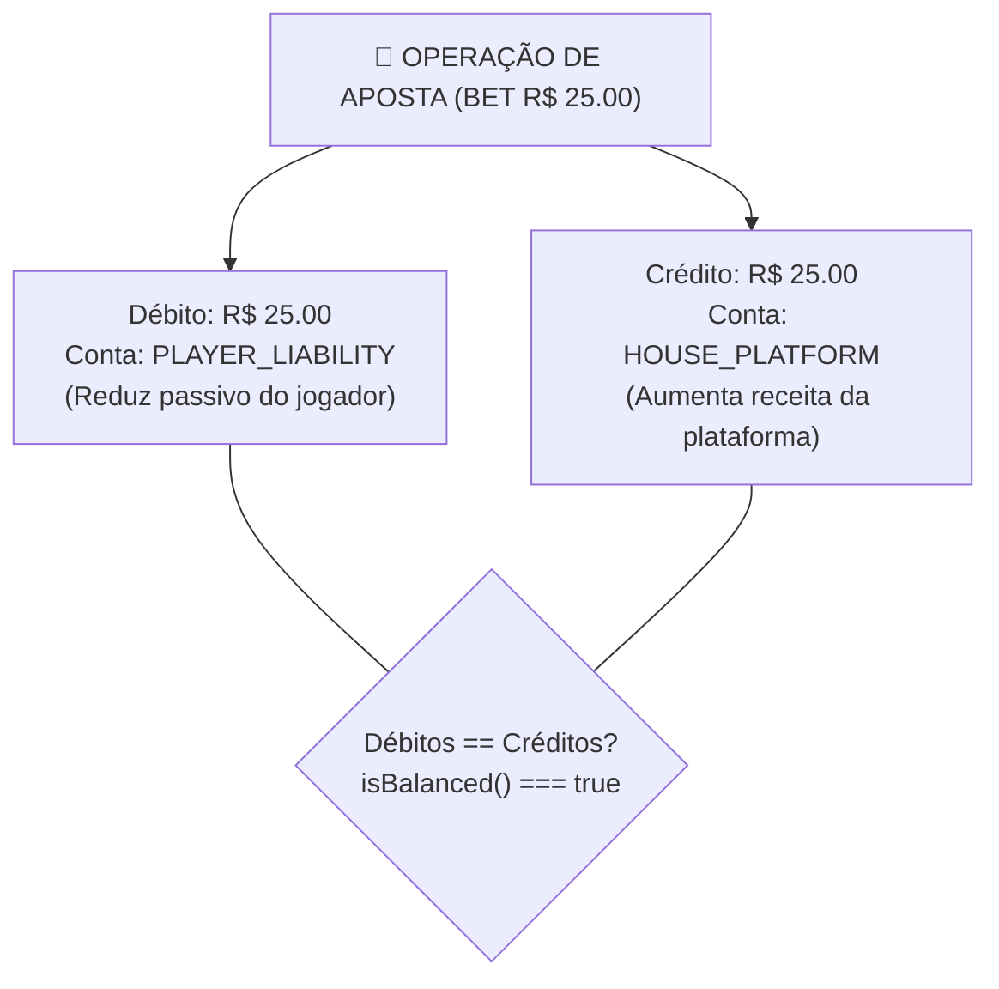

# 04 — Concorrência, Locking & Double-Entry 🔒

## 1. Concorrência por Carteira (*Pessimistic Locking*)

A unidade fundamental de concorrência do sistema é a **`walletId`**.

> [!IMPORTANT]
> **Prevenção de Deadlocks (`lock_timeout`)**:
> Ao executar `findById(walletId, true)`, o repositório configura `SET LOCAL lock_timeout = '2000ms'`. Se uma linha do banco ficar travada por mais de 2 segundos, o PostgreSQL interrompe a transação imediatamente com um erro previsível de timeout (*fail-fast*), impedindo travamento de conexões.

Quando duas ou mais apostas tentam alterar o saldo da mesma carteira simultaneamente em instâncias diferentes da aplicação:

1. A primeira instância inicia o Unit of Work (`em.transactional()`).
2. Executa a leitura bloqueante da linha no PostgreSQL:
   ```sql
   SELECT * FROM wallets WHERE id = 'wallet-id-1' FOR UPDATE;
   ```
3. As instâncias concorrentes aguardam a liberação do lock da linha no banco de dados.
4. O saldo e a versão da carteira são atualizados de forma totalmente serializada, garantindo que o saldo nunca fique negativo e que zero *lost updates* ocorram.

---

## 2. Idempotência por Hash Canônico (`payloadHash`)

Para identificar se requisições repetidas tratam-se do mesmo payload ou de um conflito de dados:

1. **JSON Canônico**: As chaves do objeto JSON de negócio (`externalTransactionId`, `gameId`, `kind`, `money`, `playerId`, `providerId`, `referenceExternalTransactionId`, `roundId`, `walletId`) são ordenadas alfabeticamente.
2. **SHA-256 Hash**: É gerado um hash digest único (`payloadHash`) de 64 caracteres.
3. **Comparações**:
   - **Chave e Hash Idênticos**: A API responde o DTO original gravado com `idempotentReplay: true`.
   - **Chave Igual e Hash Difere**: A API rejeita a requisição com HTTP `409 Conflict` (`IdempotencyConflictError`).

---

## 3. Double-Entry Bookkeeping (Partidas Dobradas)

Todas as movimentações financeiras são registradas segundo os princípios de partidas dobradas de contabilidade:



- Cada transação gera um par balanceado onde a soma dos débitos é exatamente igual à soma dos créditos (`isBalanced() === true`).
- Permite que auditores financeiros verifiquem a integridade do sistema reconciliando contas contábeis de passivo (`PLAYER_LIABILITY`), liquidação com provedores (`PROVIDER_SETTLEMENT`) e conta da casa (`HOUSE_PLATFORM`).
