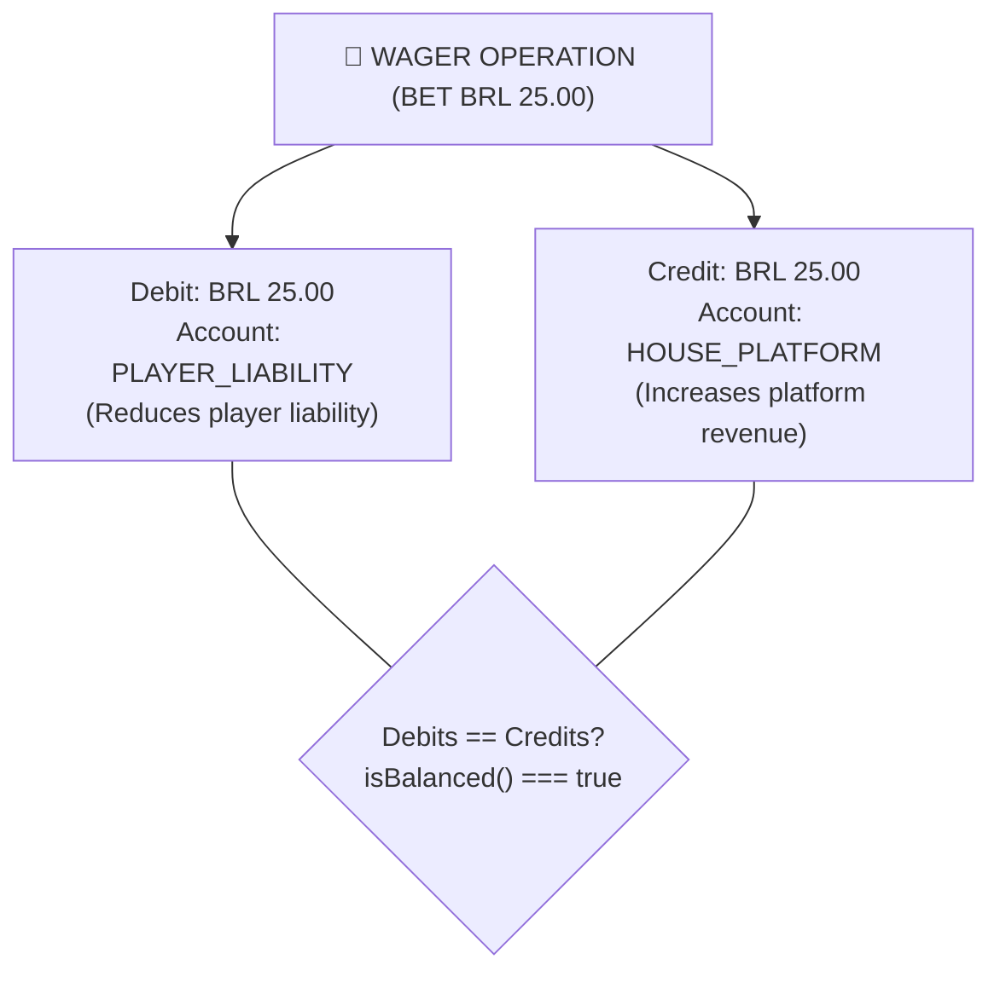

# 04 — Concurrency, Locking & Double-Entry Bookkeeping 🔒

## 1. Per-Wallet Concurrency (*Pessimistic Locking*)

The fundamental unit of concurrency in the system is the **`walletId`**.

> [!IMPORTANT]
> **Deadlock Prevention (`lock_timeout`)**:
> When executing `findById(walletId, true)`, the repository executes `SET LOCAL lock_timeout = '2000ms'`. If a database row is locked for longer than 2 seconds, PostgreSQL immediately aborts the transaction with a predictable timeout error (*fail-fast*), preventing connection pool starvation.

When two or more wagers attempt to mutate the balance of the same wallet simultaneously across different application instances:

1. The first instance initiates the Unit of Work (`em.transactional()`).
2. Performs a blocking row-level read in PostgreSQL:
   ```sql
   SELECT * FROM wallets WHERE id = 'wallet-id-1' FOR UPDATE;
   ```
3. Concurrent instances wait for the release of the row-level lock in the database.
4. Wallet balance and version are updated in a fully serialized manner, guaranteeing that the balance never drops below zero and zero *lost updates* occur.

---

## 2. Idempotency via Canonical Hash (`payloadHash`)

To identify whether repeated requests represent identical payloads or data conflicts:

1. **Canonical JSON**: Business object keys (`externalTransactionId`, `gameId`, `kind`, `money`, `playerId`, `providerId`, `referenceExternalTransactionId`, `roundId`, `walletId`) are sorted alphabetically.
2. **SHA-256 Hash**: A unique 64-character SHA-256 digest (`payloadHash`) is computed.
3. **Comparisons**:
   - **Matching Key & Hash**: The API returns the saved DTO with `idempotentReplay: true`.
   - **Matching Key & Differing Hash**: The API rejects the request with HTTP `409 Conflict` (`IdempotencyConflictError`).

---

## 3. Double-Entry Bookkeeping

All financial movements are recorded following standard accounting principles of double-entry bookkeeping:



- Every transaction generates a balanced pair where total debits equal total credits (`isBalanced() === true`).
- Financial auditors can verify system integrity by reconciling liability accounts (`PLAYER_LIABILITY`), provider settlement accounts (`PROVIDER_SETTLEMENT`), and platform house accounts (`HOUSE_PLATFORM`).
