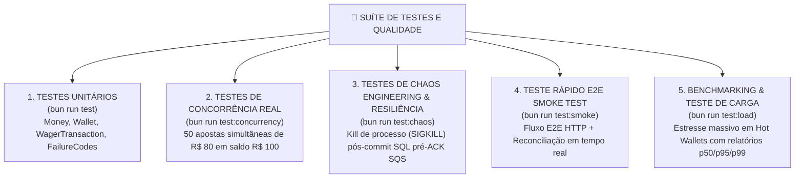

# 06 — Suíte de Testes & Garantia de Qualidade 🧪

O projeto possui uma **suíte multinível de testes automatizados**, cobrindo desde a lógica atômica do domínio até cenários de estresse concorrente, resiliência a crashes e benchmarking de carga.

---

## 🗺️ Mapa de Cobertura de Testes

---

## 1. Testes Unitários (`bun run test`)

Localização: `tests/unit/`

Focam na validação das regras de negócio atômicas e dos Value Objects, sem dependência de banco de dados ou serviços externos:

- 🧪 **`money.test.ts`**:
  - Garante a rejeição de `NaN`, `Infinity`, notação científica (`1e2`), valores negativos e mais de 2 casas decimais.
  - Valida a imutabilidade e operações de adição/subtração com precisão exata do `Decimal.js`.
  - Verifica o disparo de `CurrencyMismatchError` ao tentar operar moedas diferentes (ex.: `BRL` com `USD`).
- 🧪 **`wallet.test.ts`**:
  - Testa as factories estáticas (`open()`, `rehydrate()`).
  - Valida o débito e crédito atômico na `Wallet`, atualização da versão e cálculo exato de saldo.
  - Garante o disparo de `InsufficientBalanceError` em débitos que ultrapassem o saldo atual.
- 🧪 **`wager-transaction.test.ts`**:
  - Valida a máquina de estados imutável das transações (`PENDING`, `PROCESSED`, `REJECTED`, `PENDING_REFERENCE`, `FAILED`).
  - Testa as regras específicas por tipo de transação (`BET`, `WIN`, `LOSS`, `REFUND`, `ROLLBACK`).

---

## 2. Testes de Concorrência Real (`bun run test:concurrency`)

Localização: `tests/concurrency/concurrency.test.ts`

Simulam um cenário real de disputa agressiva de saldo por um mesmo jogador em instâncias/threads paralelas:

- **Cenário**: Uma carteira é criada com saldo de **R$ 100,00 BRL**.
- **Ação**: O script dispara **50 requisições simultâneas de aposta de R$ 80,00 BRL** usando `Promise.all()`.
- **Garantia Testada**: O PostgreSQL `SELECT FOR UPDATE` com `lock_timeout` serializa a execução no banco de dados.
- **Resultado Esperado**:
  - Exatamente **1 aposta é APROVADA** (`status: PROCESSED`).
  - Exatamente **49 apostas são REJEITADAS** por saldo insuficiente (`status: REJECTED` / `failureCode: INSUFFICIENT_FUNDS`).
  - Saldo final da carteira permanece rigorosamente em **R$ 20,00 BRL** com zero *lost updates*.

---

## 3. Chaos Engineering & Resiliência (`bun run test:chaos`)

Localização: `tests/integration/chaos.test.ts`

Valida a resiliência do sistema diante de falhas fatais de infraestrutura:

- **Cenário**: O consumidor SQS recebe uma mensagem de aposta e inicia o processamento SQL. A transação faz o `COMMIT` no PostgreSQL (gravando `Wallet`, `Ledger` e `InboxMessage`), mas o processo Node/Bun sofre um `SIGKILL` (interrupção abrupta) **antes de enviar o ACK `DeleteMessage` ao SQS**.
- **Ação**: O SQS detecta a ausência de ACK e reentrega a mensagem para o consumidor após a visibilidade expirar.
- **Garantia Testada**: A chave `PRIMARY KEY (consumer_name, message_id)` na tabela `inbox_messages` intercepta a mensagem reentregue.
- **Resultado Esperado**: O sistema emite o ACK no SQS e encerra o processamento **sem debitar o saldo uma segunda vez** e sem gerar lançamentos duplicados no extrato contábil.

---

## 4. Teste Rápido E2E Smoke Test (`bun run test:smoke`)

Localização: `scripts/smoke-test.ts`

Um teste rápido de fumaça ideal para execução manual ou validação pré-deploy:

- Executa uma sequência completa contra os endpoints HTTP da API:
  1. `POST /wallets`: Cria carteira com R$ 100,00 BRL;
  2. Dispara 2 apostas concorrentes de R$ 80,00 BRL;
  3. `POST /wallets/:id/reconciliation`: Reconcilia o saldo no banco e extrato;
- Exibe o resultado formatado e colorido diretamente no terminal.

---

## 5. Benchmarking & Teste de Carga (`bun run test:load`)

Localização: `scripts/load-test.ts`

Executa testes de estresse e medição de desempenho com relatórios estatísticos detalhados:

- Simula centenas de requisições por segundo (*Hot Wallet* e múltiplas carteiras aleatórias).
- Mede e exibe no terminal:
  - **Throughput (RPS)**;
  - **Latência p50, p95 e p99** em milissegundos;
  - **Contagem de Replays Idempotentes** e conflitos (409);
  - **Auditoria de Reconciliação Financeira** pós-estresse.
