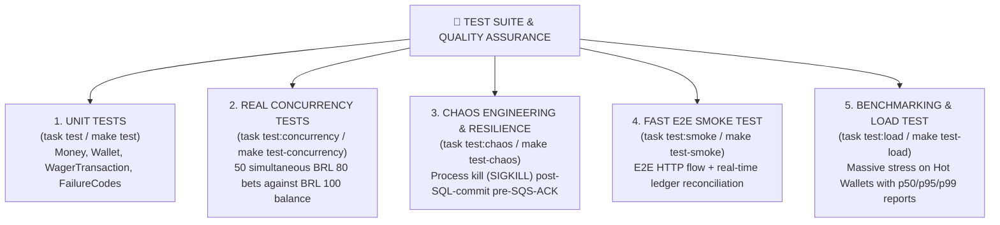

# 06 — Test Suite & Quality Assurance 🧪

The project features a **multi-level automated test suite**, covering everything from atomic domain logic to concurrent stress scenarios, process crash resilience, and load benchmarking.

---

## 🗺️ Test Coverage Map

---

## 1. Unit Tests (`task test` / `make test`)

Location: `tests/unit/`

Focus on verifying atomic business rules and Value Objects without external database or network dependencies:

- 🧪 **`money.test.ts`**:
  - Ensures rejection of `NaN`, `Infinity`, scientific notation (`1e2`), negative values, and more than 2 decimal places.
  - Validates immutability and addition/subtraction operations using exact `Decimal.js` precision.
  - Verifies throwing `CurrencyMismatchError` when operating across different currencies (e.g., `BRL` with `USD`).
- 🧪 **`wallet.test.ts`**:
  - Tests static factory methods (`open()`, `rehydrate()`).
  - Validates atomic credit and debit on `Wallet`, version incrementing, and exact balance computation.
  - Ensures `InsufficientBalanceError` is thrown when debits exceed current balance.
- 🧪 **`wager-transaction.test.ts`**:
  - Validates the immutable state machine of transactions (`PENDING`, `PROCESSED`, `REJECTED`, `PENDING_REFERENCE`, `FAILED`).
  - Tests specific business logic per transaction kind (`BET`, `WIN`, `LOSS`, `REFUND`, `ROLLBACK`).

---

## 2. Real Concurrency Tests (`task test:concurrency` / `make test-concurrency`)

Location: `tests/concurrency/concurrency.test.ts`

Simulates an aggressive real-world scenario of simultaneous balance contention for the same player across parallel threads/instances:

> [!IMPORTANT]
> **Zero Lost-Updates Validation**:
> A wallet is initialized with **BRL 100.00** balance and receives **50 simultaneous requests of BRL 80.00** using `Promise.all()`. The test asserts that **exactly 1 bet succeeds** and **49 are rejected**, leaving the perfect final balance of **BRL 20.00**.

---

## 3. Chaos Engineering & Resilience (`task test:chaos` / `make test-chaos`)

Location: `tests/integration/chaos.test.ts`

Validates system resilience against fatal infrastructure crashes:

> [!WARNING]
> **Fatal Crash Simulation (`SIGKILL`)**:
> The test terminates the Node/Bun process with `SIGKILL` immediately after the PostgreSQL `COMMIT` but before sending SQS `ACK`. When the service restarts, SQS redelivers the message and the system intercepts it via `inbox_messages`, issuing a clean ACK without duplicating debits or creating duplicate accounting ledger entries.

---

## 4. Fast E2E Smoke Test (`task test:smoke` / `make test-smoke`)

Location: `scripts/smoke-test.ts`

A rapid smoke test ideal for manual verification or pre-deployment validation:

- Executes a complete sequence against API HTTP endpoints:
  1. `POST /wallets`: Creates wallet with BRL 100.00;
  2. Dispatches 2 concurrent bets of BRL 80.00;
  3. `POST /wallets/:id/reconciliation`: Reconciles database balance with ledger entries;
- Outputs formatted, colorized results directly in the terminal.

---

## 5. Benchmarking & Load Testing (`task test:load` / `make test-load`)

Location: `scripts/load-test.ts`

Executes stress tests and measures performance with detailed statistical reports:

- Simulates hundreds of requests per second (*Hot Wallet* and multiple randomized wallets).
- Measures and reports in the terminal:
  - **Throughput (RPS)**;
  - **p50, p95, and p99 latency** in milliseconds;
  - **Idempotent Replay Count** and conflict responses (409);
  - **Post-stress Financial Reconciliation Audit**.
